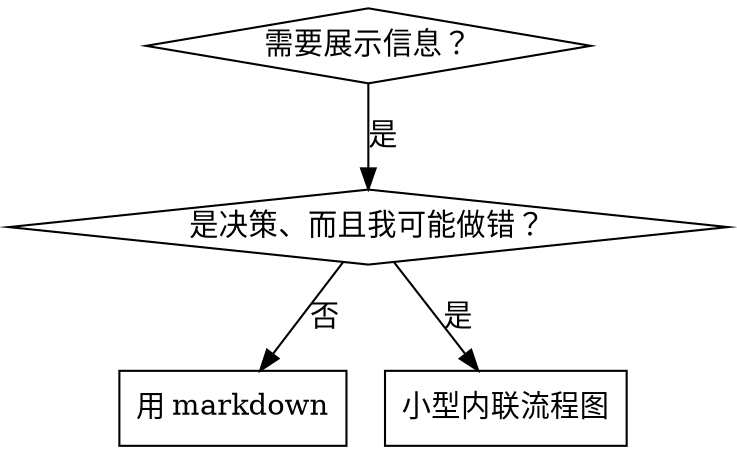

# 编写技能

## 概述

**编写技能就是把测试驱动开发（TDD）应用到过程文档上。**

**个人技能放在技能根目录里** —— 用户级是 `~/.dsh/skills/`，项目级是 `<项目根>/.dsh/skills/`。DSH 只扫描技能根下的一层，即 `<技能根>/<技能名>/SKILL.md`，不会递归到子目录。

你编写测试用例（带子代理的压力场景），看它们失败（基线行为），编写技能（文档），看测试通过（代理遵守），然后重构（堵住漏洞）。

**核心原则：** 如果你没有亲眼看到代理在没有该技能时如何失败，你就不知道这个技能教的是不是正确的东西。

## 证据闸门：不要把推演写成测试结果

技能测试必须区分三种内容：

- **目标**：技能希望代理做出的行为，可以在运行前写成验收标准。
- **预测**：你猜代理可能如何回答，只能用来设计场景，必须标为待验证。
- **观测**：真实 `subagent` 的完整返回、工具调用记录或等价 transcript；只有观测能证明基线失败、技能遵守或回归。

**硬规则：** “agent 会选 B”“预期结果是……”和“应该 100% 遵守”都不是 RED/GREEN 证据。没有实际运行和原始输出时，只能写“未验证”，不能写选择、借口、遵守率或成功结论。先保存原始输出，再从输出逐字摘录行为，最后下结论；推演不得伪装成记录；加上“草稿”“示意”或“非逐字引文”也不能补造结果。实际运行却未出现目标违规时，如实记录“本次未复现”，不强行造红。

**基线版本：** 新建技能用无技能对照；修改现有技能用修改前版本（或仅移除待测新增条款的版本）对照。下文“不带技能”的基线步骤，在修改任务中均指这个旧版对照。两组使用独立新上下文，保持任务提示、模型与运行条件可比，只改变待测指导，并保存实际加载版本。额外提示正确答案的探针仅作探索记录，不能证明文档改动有效。

每轮测试至少登记：场景与完整提示词、技能状态与版本、运行方式、原始输出、直接观察和结论。若无法提供其中的原始输出，停止扩大文档改动，先补一次有界探针。

**必需背景：** 使用本技能之前，你必须先理解 `test-driven-development` 技能。它定义了 RED-GREEN-REFACTOR 这一基本循环。本技能把 TDD 适配到文档写作上。

**推荐资料：** DSH 技能写作最佳实践见 anthropic-best-practices.md。该文档提供了额外的模式与准则，与本技能以 TDD 为核心的方法互补。

## 什么是技能？

**技能**是针对经过验证的技术、模式或工具的参考指南。技能帮助未来的代理找到并应用有效的做法。

**技能是：** 可复用的技术、模式、工具、参考指南

**技能不是：** 讲述你某一次如何解决问题的记叙文

## 技能与 TDD 的对应关系

| TDD 概念 | 技能创建 |
|-------------|----------------|
| **测试用例** | 带子代理的压力场景 |
| **生产代码** | 技能文档（SKILL.md） |
| **测试失败（RED）** | 代理在没有技能时违反规则（基线） |
| **测试通过（GREEN）** | 代理在技能存在时遵守规则 |
| **重构** | 在保持遵守的前提下堵住漏洞 |
| **先写测试** | 在写技能之前先跑基线场景 |
| **看着它失败** | 逐字记录代理使用的自我合理化说法 |
| **最小代码** | 只针对这些具体违规来写技能 |
| **看着它通过** | 运行同一场景，依据实际输出确认代理遵守 |
| **重构循环** | 发现新的自我合理化 → 堵住 → 重新验证 |
| **证据记录** | 保存原始输出，区分目标、预测、观察和结论 |

整个技能创建过程都遵循 RED-GREEN-REFACTOR。

## 何时创建技能

**在以下情况创建：**
- 技术对你来说并不是一眼就明白的
- 你在多个项目中还会反复参考它
- 模式适用范围广（不是项目专属）
- 其他人也会受益

**以下情况不要创建：**
- 一次性的解决方案
- 已在别处有完善文档的标准做法
- 项目专属约定（放进你的指令文件）
- 机械性约束（能用正则/校验强制执行的，就去自动化 —— 文档留给需要判断力的地方）

## 技能类型

### 技术
有具体步骤可循的方法（condition-based-waiting、root-cause-tracing）

### 模式
看待问题的方式（flatten-with-flags、test-invariants）

### 参考
API 文档、语法指南、工具文档（office docs）

## 目录结构


```
skills/
  skill-name/
    SKILL.md              # 主参考（必需）
    supporting-file.*     # 仅在需要时添加
```

**扁平命名空间** —— 所有技能共用一个可搜索的命名空间；DSH 只扫描技能根下的一层（`<技能根>/<技能名>/SKILL.md`），不会递归。

**以下内容拆成独立文件：**
1. **重型参考**（100 行以上）—— API 文档、完整语法说明
2. **可复用工具** —— 脚本、实用程序、模板

**保留在正文内：**
- 原则与概念
- 代码模式（< 50 行）
- 其它一切

## SKILL.md 的结构

**frontmatter（YAML）：**
- 两个必填字段：`name` 与 `description`；DSH 还认可可选字段 `whenToUse`、`metadata`、`disable-model-invocation`、`user-invocable`
- 总计最多 1024 个字符
- `name`：只能用小写英文字母、数字和连字符（kebab-case，不能有括号或特殊字符）
- `description`：第三人称，只描述何时使用（不描述它做什么）
  - 以“在……时使用”开头，聚焦触发条件
  - 包含具体的症状、情境和上下文
  - **绝不概括技能的过程或工作流**（原因见 SDO 一节）
  - 尽量控制在 500 个字符以内

```markdown
---
name: skill-name-with-hyphens
description: 当[具体的触发条件与症状]时使用
---

# 技能名

## 概述
这是什么？用 1-2 句话说明核心原则。

## 何时使用
[只在判断不明显时放一个小型内联流程图]

带症状和使用场景的项目符号列表
何时不要使用

## 核心模式（用于技术类/模式类技能）
改前/改后的代码对比

## 快速参考
表格或项目符号，便于扫读常见操作

## 实现
简单模式的代码直接内联
重型参考或可复用工具链接到文件

## 常见错误
哪里会出错 + 怎么修

## 实际影响（可选）
具体的结果
```


## 技能发现优化（SDO）

**对可发现性至关重要：** 未来的代理需要**找到**你的技能

### 1. 内容充足的 description 字段

**目的：** 你的代理会读 description 来决定针对某个任务该加载哪些技能。让它能回答：“我现在应该读这个技能吗？”

**格式：** 以“在……时使用”开头，聚焦触发条件

**关键：description = 何时使用，而不是技能做什么**

description 只应该描述触发条件。**不要**在 description 里概括技能的过程或工作流。

**为什么重要：** 测试发现，当 description 概括了技能的工作流时，代理可能照着 description 做，而不去读完整的技能正文。一个写着“任务之间做代码评审”的 description 让代理只做了一次评审，尽管技能的流程图明确画了两次评审（先规格符合性，再代码质量）。

当 description 被改成“在执行包含互相独立任务的实现计划时使用”（不含工作流概括）后，代理就正确地读了流程图，并遵循两阶段评审流程。

**陷阱在于：** 概括工作流的 description 制造了一条代理会走的捷径。技能正文于是变成了代理会跳过的文档。

```yaml
# ❌ 坏：概括了工作流 —— 代理可能照它做，而不去读技能
description: 在执行计划时使用 —— 每个任务派发一个子代理，任务之间做代码评审

# ❌ 坏：过程细节太多
description: 用于 TDD —— 先写测试，看着它失败，写最小代码，重构

# ✅ 好：只有触发条件，没有工作流概括
description: 在当前会话中执行包含互相独立任务的实现计划时使用

# ✅ 好：只有触发条件
description: 实现任何功能或修复缺陷、在写实现代码之前使用
```

**内容：**
- 使用具体的触发条件、症状和情境，表明这个技能适用
- 描述*问题*（竞态条件、行为不一致），而不是*特定语言的症状*（setTimeout、sleep）
- 触发条件保持技术无关，除非技能本身就是针对特定技术的
- 如果技能针对特定技术，就在触发条件里写明
- 用第三人称书写（它会被注入系统提示词）
- **绝不概括技能的过程或工作流**

```yaml
# ❌ 坏：太抽象、含糊，没有说明何时使用
description: 用于异步测试

# ❌ 坏：第一人称
description: 当异步测试不稳定时，我可以帮你处理

# ❌ 坏：提到了技术，但技能并不针对该技术
description: 当测试使用 setTimeout/sleep 且不稳定时使用

# ✅ 好：以“在……时使用”开头，描述问题，不含工作流
description: 当测试存在竞态条件、时序依赖，或通过/失败结果不一致时使用

# ✅ 好：针对特定技术，且触发条件明确
description: 在使用 React Router 并处理身份认证重定向时使用
```

### 2. 关键词覆盖

使用代理会去搜索的词：
- 错误信息：“ENOTEMPTY”、“race condition”、“Permission denied”
- 症状：“flaky”、“hanging”、“zombie”、“pollution”
- 同义词：“timeout/hang/freeze”、“cleanup/teardown/afterEach”
- 工具：真实的命令、库名、文件类型

### 3. 描述性命名

**用主动语态、动词开头：**
- ✅ `creating-skills` 而不是 `skill-creation`
- ✅ `condition-based-waiting` 而不是 `async-test-helpers`

### 4. Token 效率（关键）

**问题：** 入门类和被频繁引用的技能会加载进**每一次**会话。每一个 token 都要省。

**目标词数：**
- 入门工作流：每个 <150 词
- 频繁加载的技能：合计 <200 词
- 其它技能：<500 词（同样要简洁）

**技巧：**

**把细节移到工具的帮助里：**
```text
# ❌ 坏：在 SKILL.md 里记录所有参数
search-conversations 支持 --text、--both、--after DATE、--before DATE、--limit N

# ✅ 好：指向 --help
search-conversations 支持多种模式和过滤条件。细节运行 --help 查看。
```

**使用交叉引用：**
```markdown
# ❌ 坏：重复工作流细节
搜索时，用模板派发子代理……
[重复 20 行的指令]

# ✅ 好：引用其它技能
始终使用子代理（节省 50-100 倍上下文）。必需：工作流使用 [other-skill-name]。
```

**压缩示例：**
```markdown
# ❌ 坏：啰嗦的示例（42 词）
使用者：“我们之前是怎么处理 React Router 的身份认证错误的？”
你：我去搜一下过去的对话，找 React Router 的身份认证模式。
[用搜索词派发子代理：“React Router authentication error handling 401”]

# ✅ 好：最小示例（20 词）
搭档：“我们之前是怎么处理 React Router 的认证错误的？”
你：搜索中……
[派发子代理 → 综合]
```

**消除冗余：**
- 不要重复交叉引用技能里已有的内容
- 不要解释命令本身就显而易见的东西
- 同一个模式不要给多个示例

**验证：**
```bash
node -e "console.log(require('fs').readFileSync('skills/path/SKILL.md','utf8').trim().split(/\s+/).length)"   # 统计词数（DSH 里用 run_code 执行 Node 脚本）
# 入门工作流：每个目标 <150 词
# 其它高频加载技能：合计目标 <200 词
```

**按你做的事或核心洞察命名：**
- ✅ `condition-based-waiting` > `async-test-helpers`
- ✅ `using-skills` 而不是 `skill-usage`
- ✅ `flatten-with-flags` > `data-structure-refactoring`
- ✅ `root-cause-tracing` > `debugging-techniques`

**动名词（-ing）很适合过程类技能：**
- `creating-skills`、`testing-skills`、`debugging-with-logs`
- 主动，描述你正在做的动作

### 5. 交叉引用其它技能

**编写引用其它技能的文档时：**

只写技能名，并带上明确的要求标记：
- ✅ 好：`**必需子技能：** 使用 test-driven-development`
- ✅ 好：`**必需背景：** 你必须理解 systematic-debugging`
- ❌ 不好：`见 skills/testing/test-driven-development`（看不出是必需还是可选）
- ❌ 不好：`@skills/testing/test-driven-development/SKILL.md`（强制加载，浪费上下文）

**为什么不用 @ 链接：** `@` 语法会立刻强制加载文件，在你需要它们之前就消耗掉 20 万以上的上下文。

## 流程图的使用



**只在以下情况使用流程图：**
- 不明显的决策点
- 你可能会过早停下的过程循环
- “该用 A 还是 B”的决策

**绝不要为以下内容使用流程图：**
- 参考材料 → 表格、列表
- 代码示例 → Markdown 代码块
- 线性指令 → 编号列表
- 没有语义的标签（step1、helper2）

graphviz 风格规则见本目录下的 `graphviz-conventions.dot`。

**为使用者做可视化：** 用本目录下的 `render-graphs.js` 把技能的流程图渲染成 SVG：
```bash
node ./render-graphs.js ../some-skill           # 每张图单独输出
node ./render-graphs.js ../some-skill --combine # 所有图合成一张 SVG
```

## 代码示例

**一个优秀的示例胜过许多平庸的示例**

选择最合适的语言：
- 测试技术 → TypeScript/JavaScript
- 系统调试 → Python
- 数据处理 → Python

**好的示例：**
- 完整且可运行
- 注释充分，解释**为什么**
- 来自真实场景
- 清楚展示模式
- 拿来就能改编（不是通用模板）

**不要：**
- 用 5 种以上语言实现
- 做填空题式的模板
- 写生编硬造的示例

你很擅长移植 —— 一个出色的示例就够了。

## 文件组织

### 自包含技能
```
defense-in-depth/
  SKILL.md    # 全部内容内联
```
适用：所有内容都放得下，不需要重型参考

### 带可复用工具的技能
```
condition-based-waiting/
  SKILL.md    # 概述 + 模式
  example.ts  # 可直接使用的辅助代码，供改编
```
适用：工具是可复用的代码，而不只是叙述

### 带重型参考的技能
```
pptx/
  SKILL.md       # 概述 + 工作流
  pptxgenjs.md   # 600 行 API 参考
  ooxml.md       # 500 行 XML 结构
  scripts/       # 可执行工具
```
适用：参考材料太大，放不进正文

随技能打包的脚本要在正文里用解释器调用（`node scripts/tool.js`、`python scripts/tool.py`），绝不要让读者按裸路径执行：打包流程可能剥掉可执行位，裸跑 `scripts/tool.sh` 会以 `Permission denied` 失败。

## 铁律（与 TDD 相同）

```
没有先失败的测试，绝不写技能
```

这条规则对**新技能**和**对现有技能的修改**同样适用。

先写技能再测试？删掉它。从头开始。
没测试就改技能？同样是违规。

**没有例外：**
- 不因为是“简单的补充”而例外
- 不因为是“只是加一节”而例外
- 不因为是“文档更新”而例外
- 不要把未测试的改动留作“参考”
- 不要一边跑测试一边“改造”它
- 删除就是删除

**必需背景：** `test-driven-development` 技能解释了为什么这很重要。同样的原则也适用于文档。

## 测试所有类型的技能

不同类型的技能需要不同的测试方法：

### 纪律约束型技能（规则/要求）

**例子：** TDD、verification-before-completion、designing-before-coding

**测试方法：**
- 学术性问题：他们理解规则吗？
- 压力场景：在压力下他们会遵守吗？
- 多种压力叠加：时间 + 沉没成本 + 疲惫
- 找出自我合理化说法，加入明确的应对

**成功标准：** 代理在最大压力下仍遵守规则

### 技术型技能（操作指南）

**例子：** condition-based-waiting、root-cause-tracing、defensive-programming

**测试方法：**
- 应用场景：他们能正确应用这项技术吗？
- 变体场景：他们会处理边界情况吗？
- 信息缺失测试：指令里有缺口吗？

**成功标准：** 代理能把技术成功应用到新场景

### 模式型技能（心智模型）

**例子：** reducing-complexity、信息隐藏概念

**测试方法：**
- 识别场景：他们能认出模式何时适用吗？
- 应用场景：他们会用这个心智模型吗？
- 反例：他们知道什么时候**不要**用吗？

**成功标准：** 代理能正确判断模式何时适用、如何应用

### 参考型技能（文档/API）

**例子：** API 文档、命令参考、库指南

**测试方法：**
- 检索场景：他们能找到正确的信息吗？
- 应用场景：他们能正确使用找到的内容吗？
- 缺口测试：常见用例都覆盖了吗？

**成功标准：** 代理能找到并正确应用参考信息

## 跳过测试的常见自我合理化

| 借口 | 现实 |
|--------|---------|
| “技能明显很清楚” | 你觉得清楚 ≠ 别的代理觉得清楚。去测。 |
| “它只是个参考文档” | 参考文档也会有缺口和含混的章节。测检索。 |
| “测试是杀鸡用牛刀” | 没测过的技能一定有问题。总是如此。测 15 分钟省下几个小时。 |
| “等问题出现我再测” | 问题出现 = 代理用不了这个技能。部署前就测。 |
| “测试太繁琐了” | 测试比在生产环境里调试坏技能要轻松。 |
| “我确信它很好” | 过度自信必然出问题。照样测。 |
| “学术评审就够了” | 读 ≠ 用。测应用场景。 |
| “没时间测” | 部署未测试的技能，之后修复要花更多时间。 |

**以上所有说法都意味着：部署前先测试。没有例外。**

## 让形式匹配失败类型

写指导语之前，先给基线失败分类。对某一类失败能起到防弹效果的形式，对另一类失败会明显地适得其反。

| 基线失败 | 正确的形式 | 错误的形式 |
|---|---|---|
| 压力下跳过/违反规则（明知不该做还是做了） | 禁止性规定 + 自我合理化对照表 + 危险信号（见下文“防弹化”） | 软性指导（“最好……”“可以考虑……”） |
| 会遵守，但产出形态不对（提示词臃肿、结论被埋、复述规格） | 正面配方或契约：说明产出**是**什么 —— 由哪些部分组成、按什么顺序 | 禁止清单（“不要复述”“绝不叙述过程”） |
| 会产出，但漏掉必需要素 | 结构性：在它要填的模板里设置必需字段或槽位 | 在模板附近写散文式的提醒 |
| 行为应取决于某个条件 | 以可观察谓词为键的条件句（“如果简报存在，就引用它”） | 无条件规则 + 豁免条款 |
| 用免责措辞代替判断，让施工者陷入防御细节 | 给出选定方案、可信契约、失败处理归属与有限验收；允许可逆决策并按反馈修正 | 反复声明不能保证、要求所有层防御、把每个未知变成停工条件 |

**为什么禁止性规定在“塑形”类问题上会适得其反：** 当存在一个相互竞争的动机（“让提示词自包含”）时，代理会跟“不要 X”讨价还价。在针对派发提示词指导语的对照措辞测试中，禁止组产生的不想要内容明显多于配方组（分布完全分离），甚至比不给指导语的对照组还差 —— 对你的具体情况做微测试，而不是想当然，但绝不要默认动用禁止性规定。配方不留讨价还价的空间：产出要么符合声明的形态，要么不符合。

**无论选哪种形式，都遵守这些规则：**
- **不要细微差别条款。** “除非重要，否则不要 X”会重新打开讨价还价 —— 在同一批措辞测试里，给一个原本有效的配方追加一条细微差别条款，就把它从稳定退化成时好时坏。真正的例外要写成以可观察谓词为键的独立条件句。
- **豁免条款不划界。** “这条限制不适用于代码块”仍然会压制代码块。如果产出的某一部分必须豁免，就重构结构，让规则够不到它。

规格和计划类技能应使作者承担设计决定。规则写清默认动作和何时需要调整；不把“证据诚实”扩成“所有阶段都必须未验证”，也不把消除全部不确定性作为完成条件。记录一次真实缺口即可，已满足约定验收就明确通过。用户指出过度谨慎时，检查造成它的模板、评审与执行规则，删除相互叠加的门禁，避免再加一张更长的禁止清单。

## 让技能对自我合理化防弹

强制纪律的技能（比如 TDD）需要能抵抗自我合理化。代理很聪明，在压力下会找到漏洞。

**适用范围：** 这套工具针对的是纪律性失败 —— 代理知道规则，但在压力下跳过它。对于产出形态错误或漏掉要素的情况，基于禁止的防弹化会适得其反；请改用“让形式匹配失败类型”一节里的形式。

**心理学说明：** 理解说服技巧**为什么**有效，有助于你系统地运用它们。关于权威、承诺、稀缺、社会认同和统一性原则的研究基础（Cialdini, 2021; Meincke et al., 2025），见 persuasion-principles.md。

### 明确堵住每一个漏洞

不要只陈述规则 —— 要禁止具体的绕行做法：

<Bad>
```markdown
先写代码再写测试？删掉它。
```
</Bad>

<Good>
```markdown
先写代码再写测试？删掉它。从头开始。

**没有例外：**
- 不要把它留作“参考”
- 不要在写测试时“改造”它
- 不要去看它
- 删除就是删除
```
</Good>

### 处理“精神 vs 字面”的争论

在开头就加入基础性原则：

```markdown
**违背规则的字面，就是违背规则的精神。**
```

这句话一次性切断了一整类“我遵循的是精神”式的自我合理化。

### 建立自我合理化对照表

从基线测试中收集自我合理化说法（见下文“测试”一节）。代理提出的每一个借口都进表：

```markdown
| 借口 | 现实 |
|--------|---------|
| “太简单了，不用测” | 简单的代码也会坏。测试只要 30 秒。 |
| “我稍后再测” | 测试立刻就能通过，什么也证明不了。 |
| “之后补测试能达到同样目的” | 后补测试 = “这段代码做了什么？”；先写测试 = “它应该做什么？” |
```

### 建立危险信号清单

让代理在自我合理化时能轻松自查：

```markdown
## 危险信号 —— 停下，从头开始

- 先写代码后写测试
- “我已经手工测过了”
- “之后再补测试能达到同样的目的”
- “重要的是精神，不是仪式”
- “这次不一样，因为……”

**以上所有情况都意味着：删掉代码。用 TDD 重新开始。**
```

### 针对违规症状更新 SDO

在 description 里加上：你**即将**违反规则时的症状：

```yaml
description: 实现任何功能或修复缺陷、在写实现代码之前使用
```

## 技能的 RED-GREEN-REFACTOR

遵循 TDD 循环，但把每个阶段的结论绑定到真实运行证据：

### RED：运行对照基线

新建技能时不加载技能；修改技能时加载旧版。用全新子代理上下文跑压力场景。先保存完整提示词、技能状态和原始返回，再从返回中逐字记录：

- 代理实际做了什么选择？
- 代理实际用了哪些自我合理化说法？
- 哪些压力在这次运行中实际触发了违规？

“代理会选 B”只能是运行前的预测；只有 transcript 显示代理实际选择 B，才可以写成基线观察；引用选项 B 或把 B 作为反例都不算。没有 transcript 时，记录必须保持“未验证”。

这就是“看着测试失败” —— 在写技能之前，你必须看到代理自然会怎么做，并能让别人根据原始输出复核你的结论。

### GREEN：编写最小技能并重跑

只针对基线中**实际出现**的具体失败写技能。不要为假想情况添加额外内容。带着技能重跑完全相同的场景，保存新的原始返回，再根据实际行为判断是否遵守。

“应该遵守”不是 GREEN；只有运行输出显示目标行为并且没有被遗漏的直接违规证据，才可以记录 GREEN。

### REFACTOR：堵住已观察到的漏洞

代理在实际运行中出现新的自我合理化说法？逐字记录它，加入明确的应对，再重跑同一场景。没有新运行证据时，不得声称漏洞已堵住、测试已通过或技能已经防弹。

### 在跑完整场景之前先微测试措辞

完整的压力场景运行是最终关卡，但每次迭代都很慢、很贵。先用微测试验证措辞本身：

1. **每次调用只取一个全新上下文的样本** —— 用 `subagent` 派发一个一次性测试子代理（要给它完整、自包含的提示词，因为子代理看不到你的会话）。系统提示词 = 这段指导语将来所处的真实上下文（完整的技能或提示词模板，而不是孤立的指导语）；用户消息 = 一个会诱发该失败的任务。保存实际提示词和完整返回。
2. **永远要带一个不给指导语的对照组。** 如果对照组没有表现出该失败，那就没有什么要修的 —— 停下，不要写这段指导语。对照组的“没有表现”也必须由实际 transcript 证明，不能凭预期填写。
3. **每个变体至少 5 次重复。** 单次样本会骗人；运行不足时标为未验证，不得推算遵守率。
4. **逐条人工阅读每一个被标记的命中。** 你可以用程序打分，但模板回声和被引用的反例会伪装成命中；只看自动计数会同时高估失败和成功。人工结论必须能回指原始输出。
5. **方差也是一项指标。** 当指导语生效时，多次重复会收敛到同一种形态。五次重复出现五种不同理解，说明措辞没有约束力 —— 先把形式收紧，再考虑加字；没有实际重复结果时，不要预测收敛。

微测试验证的是措辞；对纪律型技能，它不能替代压力场景。

**测试方法论：** 完整的测试方法论见 [testing-skills-with-subagents.md](testing-skills-with-subagents.md)：
- 如何编写压力场景
- 压力类型（时间、沉没成本、权威、疲惫）
- 系统地堵洞
- 元测试技巧

## 反模式

### ❌ 记叙文式示例
“在 2025-10-03 那次会话里，我们发现空的 projectDir 导致了……”
**为什么不好：** 太具体，不可复用

### ❌ 多语言稀释
example-js.js、example-py.py、example-go.go
**为什么不好：** 质量平庸，维护负担大

### ❌ 在流程图里放代码
```dot
step1 [label="import fs"];
step2 [label="read file"];
```
**为什么不好：** 没法复制粘贴，难读

### ❌ 通用标签
helper1、helper2、step3、pattern4
**为什么不好：** 标签应该带语义

## 停：在进入下一个技能之前

**写完任何技能之后，你必须停下来完成部署流程。**

**不要：**
- 批量创建多个技能而不逐个测试
- 当前技能还没验证就去做下一个
- 因为“批量更高效”就跳过测试

**下面的部署清单对每一个技能都是强制的。**

部署未测试的技能 = 部署未测试的代码。这违反质量标准。

## 技能创建清单（TDD 适配版）

**重要：用 `todo_write` 为下面每一个清单项各建一条待办。**

**RED 阶段 —— 运行并记录失败的基线：**
- [ ] 创建压力场景（纪律型技能要 3 种以上压力叠加）
- [ ] 登记完整提示词、技能状态、运行方式和反馈通道
- [ ] 在**没有**技能的情况下实际跑场景，保存完整原始 transcript
- [ ] 只从 transcript 逐字记录基线行为；没有输出时标为“未验证”
- [ ] 区分目标、预测、直接观察和结论，不把“agent 会……”写成事实
- [ ] 找出自我合理化/失败中的模式，并让每条模式都能回指实际运行

**GREEN 阶段 —— 编写最小技能：**
- [ ] 名称只用小写英文字母、数字、连字符（kebab-case，无括号/特殊字符）
- [ ] YAML frontmatter 含必填的 `name` 与 `description` 字段（最多 1024 字符；可选字段为 `whenToUse`、`metadata`、`disable-model-invocation`、`user-invocable`）
- [ ] description 以“在……时使用”开头，并包含具体的触发条件/症状
- [ ] description 用第三人称书写
- [ ] 全文分布关键词便于检索（错误、症状、工具）
- [ ] 有清晰的概述与核心原则
- [ ] 针对 RED 阶段找出的具体基线失败
- [ ] 指导语的形式匹配失败类型（见“让形式匹配失败类型”）
- [ ] 对塑形行为的指导语：措辞已对照“不给指导语”的对照组做过微测试（5 次以上重复，逐条人工阅读每个命中）—— 纯参考型技能不适用
- [ ] 代码内联**或**链接到独立文件
- [ ] 一个优秀的示例（不是多语言）
- [ ] **带着**技能重跑同一场景，保存原始 transcript
- [ ] 只依据实际输出记录代理是否遵守；“应该遵守”不算 GREEN

**REFACTOR 阶段 —— 堵住已观察到的漏洞（无新漏洞时修补项记为不适用）：**
- [ ] 核对实际测试是否出现**新的**自我合理化说法；有则记录，无则如实注明
- [ ] 加入明确的应对（纪律型技能）
- [ ] 用所有测试轮次建立自我合理化对照表
- [ ] 建立危险信号清单
- [ ] 完成约定场景、重复次数与必要回归，无未解决失败即停止；仅新改动、新失败或结果波动才扩展验证，结论写明样本范围

**质量检查：**
- [ ] 只在决策不明显时放小型流程图
- [ ] 快速参考表
- [ ] 常见错误一节
- [ ] 不要记叙文式的讲故事
- [ ] 支撑文件只用于工具或重型参考

**部署：**
- [ ] 把技能 commit 到 git 并推送到你的 fork（如果配置了）
- [ ] 考虑通过 PR 贡献回来（如果普遍有用）

## 发现流程

未来的代理如何找到你的技能：

1. **遇到问题**（“测试不稳定”）
2. **搜索技能**（用 `grep` 搜 description，浏览分类）
3. **找到 SKILL**（description 匹配）
4. **扫读概述**（这相关吗？）
5. **读模式**（快速参考表）
6. **加载示例**（只在实现时才加载）

**针对这个流程做优化** —— 把可检索的词放在前面，并反复出现。
