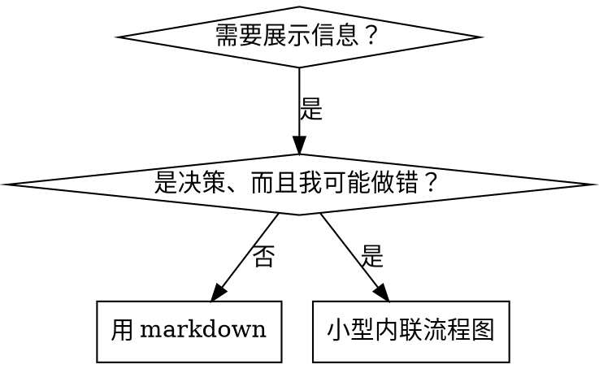

# 编写技能

## 概述

**编写技能是用可复核反馈改善过程文档；行为修正可借鉴 TDD，但验收来自用户目标。**

**个人技能放在技能根目录里** —— 用户级是 `~/.dsh/skills/`，项目级是 `<项目根>/.dsh/skills/`。DSH 只扫描技能根下的一层，即 `<技能根>/<技能名>/SKILL.md`，不会递归到子目录。

先定义用户结果、可接受代价与适用边界，再选择方法、运行基线、修改并复测。规则服从是诊断信息，不能单独证明成功；遵守规则却损害用户结果也应记录为问题。

**核心原则：** 不把假设写成事实，不把未复现写成失败，不把流程一致性当成有效性。

## 证据闸门：不要把推演写成测试结果

技能测试必须区分三种内容：

- **目标**：来自用户需求的可观察结果、成本约束与适用边界；运行前定义，不能从待测规则反推唯一答案。
- **预测**：你猜代理可能如何回答，只能用来设计场景，必须标为待验证。
- **观测**：真实 `subagent` 的完整返回、工具调用记录或等价 transcript；只有观测能证明基线失败、技能遵守或回归。

**硬规则：** “agent 会选 B”“预期结果是……”和“应该 100% 遵守”都不是 RED/GREEN 证据。没有实际运行和原始输出时，只能写“未验证”，不能写选择、借口、遵守率或成功结论。先保存原始输出，再从输出逐字摘录行为，最后下结论；推演不得伪装成记录；加上“草稿”“示意”或“非逐字引文”也不能补造结果。实际运行却未出现目标违规时，如实记录“本次未复现”，不强行造红。

**基线版本：** 新建技能用无技能对照；修改现有技能用修改前版本（或仅移除待测新增条款的版本）对照。下文“不带技能”的基线步骤，在修改任务中均指这个旧版对照。两组使用独立新上下文，保持任务提示、模型与运行条件可比，只改变待测指导，并保存实际加载版本。额外提示正确答案的探针仅作探索记录，不能证明文档改动有效。

每轮测试至少登记：场景与完整提示词、技能状态与版本、运行方式、原始输出、直接观察和结论。若无法提供其中的原始输出，停止扩大文档改动，先补一次有界探针。

**方法背景：** 行为对照可借鉴 `test-driven-development` 的 RED-GREEN-REFACTOR；静态矛盾、链接与参考准确性使用对应检查，不要求先制造行为失败。

**推荐资料：** DSH 技能写作最佳实践见 anthropic-best-practices.md。该文档提供了额外的模式与准则，与本技能的反馈和对照方法互补。

## 什么是技能？

**技能**是针对经过验证的技术、模式或工具的参考指南。技能帮助未来的代理找到并应用有效的做法。

**技能是：** 可复用的技术、模式、工具、参考指南

**技能不是：** 讲述你某一次如何解决问题的记叙文

## 有条件使用对照循环

| 阶段 | 证据与判断 |
| --- | --- |
| 基线 | 新建用无技能对照，修改用旧版；记录实际结果与代价 |
| RED | 仅在原始反馈表明未达到事先定义的用户验收时记录 |
| 修改 | 针对观测误差或明确静态矛盾做最小修正 |
| 复测 | 同任务、新上下文、新版指导，核对结果、边界与代价 |
| 收尾 | 复核受影响处，报告范围；达到约定验收即停止 |

基线未复现不等于技能无用，也不构成 RED。明确静态矛盾可以修正，但不能据此宣称行为改善。

## 何时创建技能

**在以下情况创建：**
- 技术对你来说并不是一眼就明白的
- 你在多个项目中还会反复参考它
- 模式适用范围广（不是项目专属）
- 其他人也会受益

**以下情况不要创建：**
- 一次性的解决方案
- 已在别处有完善文档的标准做法
- 项目专属约定（放进你的指令文件）
- 机械性约束（能用正则/校验强制执行的，就去自动化 —— 文档留给需要判断力的地方）

## 技能类型

### 技术
有具体步骤可循的方法（condition-based-waiting、root-cause-tracing）

### 模式
看待问题的方式（flatten-with-flags、test-invariants）

### 参考
API 文档、语法指南、工具文档（office docs）

## 目录结构


```
skills/
  skill-name/
    SKILL.md              # 主参考（必需）
    supporting-file.*     # 仅在需要时添加
```

**扁平命名空间** —— 所有技能共用一个可搜索的命名空间；DSH 只扫描技能根下的一层（`<技能根>/<技能名>/SKILL.md`），不会递归。

**以下内容拆成独立文件：**
1. **重型参考**（100 行以上）—— API 文档、完整语法说明
2. **可复用工具** —— 脚本、实用程序、模板

**保留在正文内：**
- 原则与概念
- 代码模式（< 50 行）
- 其它一切

## SKILL.md 的结构

**frontmatter（YAML）：**
- 两个必填字段：`name` 与 `description`；DSH 还认可可选字段 `whenToUse`、`metadata`、`disable-model-invocation`、`user-invocable`
- 总计最多 1024 个字符
- `name`：只能用小写英文字母、数字和连字符（kebab-case，不能有括号或特殊字符）
- `description`：第三人称，只描述何时使用（不描述它做什么）
  - 以“在……时使用”开头，聚焦触发条件
  - 包含具体的症状、情境和上下文
  - **绝不概括技能的过程或工作流**（原因见 SDO 一节）
  - 尽量控制在 500 个字符以内

```markdown
---
name: skill-name-with-hyphens
description: 当[具体的触发条件与症状]时使用
---

# 技能名

## 概述
这是什么？用 1-2 句话说明核心原则。

## 何时使用
[只在判断不明显时放一个小型内联流程图]

带症状和使用场景的项目符号列表
何时不要使用

## 核心模式（用于技术类/模式类技能）
改前/改后的代码对比

## 快速参考
表格或项目符号，便于扫读常见操作

## 实现
简单模式的代码直接内联
重型参考或可复用工具链接到文件

## 常见错误
哪里会出错 + 怎么修

## 实际影响（可选）
具体的结果
```


## 技能发现优化（SDO）

**对可发现性至关重要：** 未来的代理需要**找到**你的技能

### 1. 内容充足的 description 字段

**目的：** 你的代理会读 description 来决定针对某个任务该加载哪些技能。让它能回答：“我现在应该读这个技能吗？”

**格式：** 以“在……时使用”开头，聚焦触发条件

**关键：description = 何时使用，而不是技能做什么**

description 只应该描述触发条件。**不要**在 description 里概括技能的过程或工作流。

**为什么重要：** 测试发现，当 description 概括了技能的工作流时，代理可能照着 description 做，而不去读完整的技能正文。一个写着“任务之间做代码评审”的 description 让代理只做了一次评审，尽管技能的流程图明确画了两次评审（先规格符合性，再代码质量）。

当 description 被改成“在执行包含互相独立任务的实现计划时使用”（不含工作流概括）后，代理就正确地读了流程图，并遵循两阶段评审流程。

**陷阱在于：** 概括工作流的 description 制造了一条代理会走的捷径。技能正文于是变成了代理会跳过的文档。

```yaml
# ❌ 坏：概括了工作流 —— 代理可能照它做，而不去读技能
description: 在执行计划时使用 —— 每个任务派发一个子代理，任务之间做代码评审

# ❌ 坏：过程细节太多
description: 用于 TDD —— 先写测试，看着它失败，写最小代码，重构

# ✅ 好：只有触发条件，没有工作流概括
description: 在当前会话中执行包含互相独立任务的实现计划时使用

# ✅ 好：只有触发条件
description: 实现任何功能或修复缺陷、在写实现代码之前使用
```

**内容：**
- 使用具体的触发条件、症状和情境，表明这个技能适用
- 描述*问题*（竞态条件、行为不一致），而不是*特定语言的症状*（setTimeout、sleep）
- 触发条件保持技术无关，除非技能本身就是针对特定技术的
- 如果技能针对特定技术，就在触发条件里写明
- 用第三人称书写（它会被注入系统提示词）
- **绝不概括技能的过程或工作流**

```yaml
# ❌ 坏：太抽象、含糊，没有说明何时使用
description: 用于异步测试

# ❌ 坏：第一人称
description: 当异步测试不稳定时，我可以帮你处理

# ❌ 坏：提到了技术，但技能并不针对该技术
description: 当测试使用 setTimeout/sleep 且不稳定时使用

# ✅ 好：以“在……时使用”开头，描述问题，不含工作流
description: 当测试存在竞态条件、时序依赖，或通过/失败结果不一致时使用

# ✅ 好：针对特定技术，且触发条件明确
description: 在使用 React Router 并处理身份认证重定向时使用
```

### 2. 关键词覆盖

使用代理会去搜索的词：
- 错误信息：“ENOTEMPTY”、“race condition”、“Permission denied”
- 症状：“flaky”、“hanging”、“zombie”、“pollution”
- 同义词：“timeout/hang/freeze”、“cleanup/teardown/afterEach”
- 工具：真实的命令、库名、文件类型

### 3. 描述性命名

**用主动语态、动词开头：**
- ✅ `creating-skills` 而不是 `skill-creation`
- ✅ `condition-based-waiting` 而不是 `async-test-helpers`

### 4. Token 效率（关键）

**问题：** 入门类和被频繁引用的技能会加载进**每一次**会话。每一个 token 都要省。

**目标词数：**
- 入门工作流：每个 <150 词
- 频繁加载的技能：合计 <200 词
- 其它技能：<500 词（同样要简洁）

**技巧：**

**把细节移到工具的帮助里：**
```text
# ❌ 坏：在 SKILL.md 里记录所有参数
search-conversations 支持 --text、--both、--after DATE、--before DATE、--limit N

# ✅ 好：指向 --help
search-conversations 支持多种模式和过滤条件。细节运行 --help 查看。
```

**使用交叉引用：**
```markdown
# ❌ 坏：重复工作流细节
搜索时，用模板派发子代理……
[重复 20 行的指令]

# ✅ 好：引用其它技能
当任务适合独立委派且预期收益足以覆盖协调成本时，按 [other-skill-name] 的适用条件执行；引用其流程，不在这里重复。
```

**压缩示例：**
```markdown
# ❌ 坏：啰嗦的示例（42 词）
使用者：“我们之前是怎么处理 React Router 的身份认证错误的？”
你：我去搜一下过去的对话，找 React Router 的身份认证模式。
[用搜索词派发子代理：“React Router authentication error handling 401”]

# ✅ 好：最小示例（20 词）
搭档：“我们之前是怎么处理 React Router 的认证错误的？”
你：搜索中……
[派发子代理 → 综合]
```

**消除冗余：**
- 不要重复交叉引用技能里已有的内容
- 不要解释命令本身就显而易见的东西
- 同一个模式不要给多个示例

**验证：**
```bash
node -e "console.log(require('fs').readFileSync('skills/path/SKILL.md','utf8').trim().split(/\s+/).length)"   # 统计词数（DSH 里用 run_code 执行 Node 脚本）
# 入门工作流：每个目标 <150 词
# 其它高频加载技能：合计目标 <200 词
```

**按你做的事或核心洞察命名：**
- ✅ `condition-based-waiting` > `async-test-helpers`
- ✅ `using-skills` 而不是 `skill-usage`
- ✅ `flatten-with-flags` > `data-structure-refactoring`
- ✅ `root-cause-tracing` > `debugging-techniques`

**动名词（-ing）很适合过程类技能：**
- `creating-skills`、`testing-skills`、`debugging-with-logs`
- 主动，描述你正在做的动作

### 5. 交叉引用其它技能

**编写引用其它技能的文档时：**

只写技能名，并带上明确的要求标记：
- ✅ 好：`**必需子技能：** 使用 test-driven-development`
- ✅ 好：`**必需背景：** 你必须理解 systematic-debugging`
- ❌ 不好：`见 skills/testing/test-driven-development`（看不出是必需还是可选）
- ❌ 不好：`@skills/testing/test-driven-development/SKILL.md`（强制加载，浪费上下文）

**为什么不用 @ 链接：** `@` 语法会立刻强制加载文件，在你需要它们之前就消耗掉 20 万以上的上下文。

## 流程图的使用



**只在以下情况使用流程图：**
- 不明显的决策点
- 你可能会过早停下的过程循环
- “该用 A 还是 B”的决策

**绝不要为以下内容使用流程图：**
- 参考材料 → 表格、列表
- 代码示例 → Markdown 代码块
- 线性指令 → 编号列表
- 没有语义的标签（step1、helper2）

graphviz 风格规则见本目录下的 `graphviz-conventions.dot`。

**为使用者做可视化：** 用本目录下的 `render-graphs.js` 把技能的流程图渲染成 SVG：
```bash
node ./render-graphs.js ../some-skill           # 每张图单独输出
node ./render-graphs.js ../some-skill --combine # 所有图合成一张 SVG
```

## 代码示例

**一个优秀的示例胜过许多平庸的示例**

选择最合适的语言：
- 测试技术 → TypeScript/JavaScript
- 系统调试 → Python
- 数据处理 → Python

**好的示例：**
- 完整且可运行
- 注释充分，解释**为什么**
- 来自真实场景
- 清楚展示模式
- 拿来就能改编（不是通用模板）

**不要：**
- 用 5 种以上语言实现
- 做填空题式的模板
- 写生编硬造的示例

你很擅长移植 —— 一个出色的示例就够了。

## 文件组织

### 自包含技能
```
defense-in-depth/
  SKILL.md    # 全部内容内联
```
适用：所有内容都放得下，不需要重型参考

### 带可复用工具的技能
```
condition-based-waiting/
  SKILL.md    # 概述 + 模式
  example.ts  # 可直接使用的辅助代码，供改编
```
适用：工具是可复用的代码，而不只是叙述

### 带重型参考的技能
```
pptx/
  SKILL.md       # 概述 + 工作流
  pptxgenjs.md   # 600 行 API 参考
  ooxml.md       # 500 行 XML 结构
  scripts/       # 可执行工具
```
适用：参考材料太大，放不进正文

随技能打包的脚本要在正文里用解释器调用（`node scripts/tool.js`、`python scripts/tool.py`），绝不要让读者按裸路径执行：打包流程可能剥掉可执行位，裸跑 `scripts/tool.sh` 会以 `Permission denied` 失败。

## 验证与改动相称

行为修正先保存旧版并运行可比基线。无法运行时，明确限制和未验证项；不要补造失败或删除用户已有工作来满足形式。静态矛盾、链接、格式或参考准确性问题可依据原文或权威来源修正，完成相应复核；宣称行为改善仍需真实对照。

运行前按风险、可逆性与行为波动约定场景、样本预算和停止条件。低风险修改可用针对性探针；高风险规则选择更广边界与必要重复。没有所有修改固定五次的要求。预算耗尽且关键不确定性仍在时报告限制并重评，不无限堵洞。

## 测试所有类型的技能

不同类型的技能需要不同的测试方法：

### 纪律约束型技能（规则/要求）

**例子：** TDD、verification-before-completion、designing-before-coding

**测试方法：**
- 学术性问题：他们理解规则吗？
- 压力场景：在压力下他们会遵守吗？
- 按实际风险选择压力组合，同时观测时间、返工及调用成本
- 先判断规则是否适用；确认存在结果差距后再选择应对

**成功标准：** 在适用边界内实现用户目标，满足授权和质量约束，代价可接受；同时检查不该启用规则的反例与流程组合冲突。服从情况只帮助诊断。

### 技术型技能（操作指南）

**例子：** condition-based-waiting、root-cause-tracing、defensive-programming

**测试方法：**
- 应用场景：他们能正确应用这项技术吗？
- 变体场景：他们会处理边界情况吗？
- 信息缺失测试：指令里有缺口吗？

**成功标准：** 代理能把技术成功应用到新场景

### 模式型技能（心智模型）

**例子：** reducing-complexity、信息隐藏概念

**测试方法：**
- 识别场景：他们能认出模式何时适用吗？
- 应用场景：他们会用这个心智模型吗？
- 反例：他们知道什么时候**不要**用吗？

**成功标准：** 代理能正确判断模式何时适用、如何应用

### 参考型技能（文档/API）

**例子：** API 文档、命令参考、库指南

**测试方法：**
- 检索场景：他们能找到正确的信息吗？
- 应用场景：他们能正确使用找到的内容吗？
- 缺口测试：常见用例都覆盖了吗？

**成功标准：** 代理能找到并正确应用参考信息

## 按问题选择反馈

| 问题 | 最小有效验证 |
| --- | --- |
| 规则可能误用 | 正例、反例与组合冲突的决策探针 |
| 操作技术是否奏效 | 真实输入下的结果及副作用检查 |
| 参考文档缺口或失效链接 | 检索、可达性及信息准确性核对 |
| 静态矛盾 | 对照原文修正，复核受影响引用与示例 |

方法有适用条件。压力测试不是所有技能的默认门槛，文本评审也不能替代行为效果证据。

## 让形式匹配失败类型

写指导语之前先判断观测误差的类型。下面是候选形式，效果需在当前任务验证，不是普适规律。

| 基线失败 | 可优先验证的形式 | 需留意的风险形式 |
|---|---|---|
| 压力下跳过/违反规则（明知不该做还是做了） | 禁止性规定 + 自我合理化对照表 + 危险信号（先确认规则本身适用） | 软性指导（“最好……”“可以考虑……”） |
| 会遵守，但产出形态不对（提示词臃肿、结论被埋、复述规格） | 正面配方或契约：说明产出**是**什么 —— 由哪些部分组成、按什么顺序 | 禁止清单（“不要复述”“绝不叙述过程”） |
| 会产出，但漏掉必需要素 | 结构性：在它要填的模板里设置必需字段或槽位 | 在模板附近写散文式的提醒 |
| 行为应取决于某个条件 | 以可观察谓词为键的条件句（“如果简报存在，就引用它”） | 无条件规则 + 豁免条款 |
| 用免责措辞代替判断，让施工者陷入防御细节 | 给出选定方案、可信契约、失败处理归属与有限验收；允许可逆决策并按反馈修正 | 反复声明不能保证、要求所有层防御、把每个未知变成停工条件 |

禁止清单、正面配方和条件句都有成本。优先说明可观察条件、下一步动作与反馈。代理提出理由不自动构成自我合理化；若揭示规则不适用、目标冲突或过高代价，应修正规则而非加强措辞。没有可复核记录时，不宣称某种形式优于另一种。

规格和计划类技能应使作者承担设计决定。规则写清默认动作和何时需要调整；不把“证据诚实”扩成“所有阶段都必须未验证”，也不把消除全部不确定性作为完成条件。记录一次真实缺口即可，已满足约定验收就明确通过。用户指出过度谨慎时，检查造成它的模板、评审与执行规则，删除相互叠加的门禁，避免再加一张更长的禁止清单。

## 从反馈修正技能

1. 对照用户验收，确认问题属于结果失败、规则误用、信息缺失还是测试设计偏差。
2. 修正造成误差的最小条款，必要时删减叠加门禁。不要把每句异议都扩成禁止清单。
3. 同场景新上下文复测，检查目标、成本与受影响边界。遵守新增规则不足以判 GREEN。
4. 必要时开放询问“哪些信息影响决策？什么条件会改变选择？规则与任务是否冲突？”元测试回答只作假设，不诱导唯一预设选项，不照抄建议后当成验证。

### 有界措辞测试

每次用普通后台 `subagent` 的新上下文，提供完整任务与真实使用时的指导语，保存实际调用参数和完整返回。新建技能对照不带技能，修改对照用旧版；模型、工具等条件保持可比，不可控项如实记录。

事先选择能区分假设的场景与重复预算，包含相关反例、组合冲突和成本。微测试只说明这些输入下的决策，不能替代实际操作或高风险任务验证。人工核对原始输出，被引用选项、反例和复述不算实际动作。未复现如实报告，只有新改动、失败或波动才扩展有理由的验证。

详见 [testing-skills-with-subagents.md](testing-skills-with-subagents.md)；文档变体见 [examples/AGENTS_MD_TESTING.md](examples/AGENTS_MD_TESTING.md)。

## 反模式

### ❌ 记叙文式示例
“在 2025-10-03 那次会话里，我们发现空的 projectDir 导致了……”
**为什么不好：** 太具体，不可复用

### ❌ 多语言稀释
example-js.js、example-py.py、example-go.go
**为什么不好：** 质量平庸，维护负担大

### ❌ 在流程图里放代码
```dot
step1 [label="import fs"];
step2 [label="read file"];
```
**为什么不好：** 没法复制粘贴，难读

### ❌ 通用标签
helper1、helper2、step3、pattern4
**为什么不好：** 标签应该带语义

## 技能修改清单

将适用项合并到当前待办，不重复建立门禁：

- [ ] 明确用户结果、代价、适用边界和有界预算。
- [ ] 保存旧版、完整提示与真实基线；静态修正登记原文依据。区分目标、预测和观测。
- [ ] 最小修改，名称与 frontmatter 合法，description 描述触发条件；保留清晰概述与必要示例。
- [ ] 按问题类型验证；行为修改同场景新上下文复测并保存原始输出，检查相关反例、组合冲突和成本。
- [ ] 核对正文、参考和示例一致性，报告未复现、未验证及样本覆盖。
- [ ] 满足约定验收后停止；提交、推送及部署遵循用户授权，不由本技能自动要求。

预算限制的是本轮证据范围，不能据此把尚未满足的验收改成通过。

## 发现流程

未来的代理如何找到你的技能：

1. **遇到问题**（“测试不稳定”）
2. **搜索技能**（用 `grep` 搜 description，浏览分类）
3. **找到 SKILL**（description 匹配）
4. **扫读概述**（这相关吗？）
5. **读模式**（快速参考表）
6. **加载示例**（只在实现时才加载）

**针对这个流程做优化** —— 把可检索的词放在前面，并反复出现。
