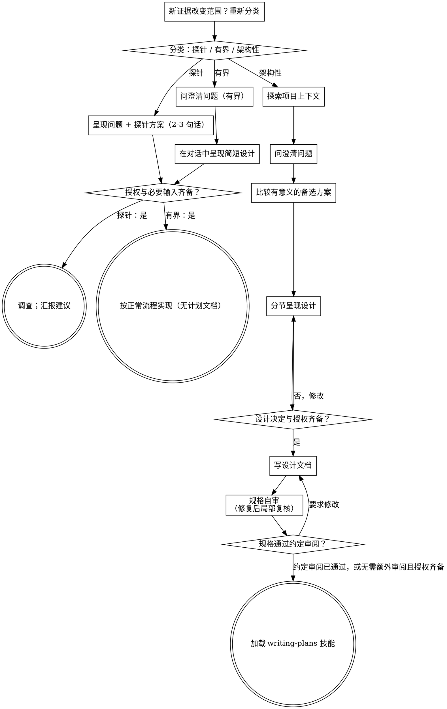

# 把想法头脑风暴为设计

通过自然的协作式对话，把想法变成成型的设计与规格。

先判断这个请求需要多少流程，再沿所选路径推进：理解上下文、打磨想法、
呈现设计，并取得使用者的认可。

## 建立共同理解

头脑风暴的产出，是一份使用者能够辨认、能够纠正的理解，并且扎根于
使用者想要达成的目标。

1. **发现意图。** 用请求本身和已有上下文，判断预期结果是什么、为谁而做、
   以及成功是什么样子。当这些信息缺失时，先就目的或预期用途问一个聚焦的
   问题，再提功能或方案。知道应用属于什么品类，并不能告诉你使用者为什么
   想要它。补齐缺失的需求，不等于要求对方再次授权这项任务。
2. **把你的理解写回去。** 简述预期结果、约束与成功标准，区分已知要求和假设。
   必要目标或边界缺失时先澄清；已有请求与认可足以确定设计时直接沿用。
3. **把意图带入设计。** 把取得共识的理解保留在所选路径的设计产物里：
   架构性工作写进书面规格；有界工作和探针则保留在对话内的设计/探针
   说明中。用这份理解去检验你提出的功能与技术选择。

当请求本身已经给出目的和约束时，复述这份理解，而不是把同样的问题再问
一遍。说明要简短；重要的是它准确，以及使用者有机会纠正它。

## 从简设计与沟通判据

先确定目标语义和不变量，再定职责与协作，最后选择接口、字段和编码。框架正确与从简同时成立：不为少写代码混合职责，也不为扩展性预建通用框架。

- **先减少业务分支。** 增加补全、修复、兼容或重试前，比较收束范围能否满足目标。删减已要求能力须明确裁定，不擅自省略。
- **机制对应明确问题。** 新机制服务已知需求、真实边界或运行反馈。明确的规模与资源约束可提前处理，不必等故障发生；未经证实的未来可能性不升级为当前需求。扩展点服务已知变化，复用前核对副作用与生命周期。
- **动态化靠变化通知。** 识别可变条件，按需更新；缓存有界、可失效、可释放，不靠每次全量重算维持正确性。
- **场景先于术语。** 按“实际场景 → 可观察行为 → 责任归属 → 必要技术细节”说明。用户不理解时先换具体例子，不继续增加术语或下钻实现。
- **代理承担普通技术判断。** 已有授权和契约内的可逆实现选择自行决定并集中说明。只将影响目标、用户行为、核心边界、长期承诺的必要取舍交给用户；一次聚焦一个关键决定，不每段都附确认题。明确要求逐项审阅时按约定执行。
- **设计需要收束。** 目标、职责、不变量、主流程与已知失败语义清楚，剩余只是可逆技术选择时，整理裁定并沿授权推进。不为维持对话制造议题，设计授权不自动扩大为实现授权。

已有裁定先读原文，避免换术语重复讨论。规格保留跨模块契约、裁定及必要理由；局部意图与失败语义在实现后附着于最近代码，不堆重复规则或施工流水。对话认可与整理稿另经书面评审须区分。

## 设计与授权边界

实现前明确目标、约束、方案和验收；产物深度由下面的路径决定。先核对当前会话的授权与评审约定：

- 用户已认可当前方案，或明确授权在已知范围内自主实施：完成必要设计与自检后推进，不因生成新文档或切换阶段重复确认。
- 用户要求逐阶段审阅：到约定节点呈现可评审产物，等待该次审阅。未经审阅的产物不能声称已获认可。
- 缺少会改变目标、外部契约或不可逆后果的必要决定，或动作超出授权：先完成独立的已授权准备，只暂停受影响步骤并提出具体问题。

有界工作可以在对话内给设计；架构性工作先写规格再编写计划。设计过程不扩大原有授权，也不取代真实行为验证。

## 三条路径

在你问出第一个问题之前，先对请求分类，并把分类结果说出来——"这看起来是
有界改动，所以我在这里给一份简短设计，而不是写规格文档"——这样使用者
可以推翻它：

- **探针（Spike）** —— 一个可行性问题（"我们能不能……""有没有可能……"
  "糙一点也没关系"），它的产出是答案，而不是你要留下的代码。用 2-3 句话
  说明问题和你要试的做法，核对已有授权后，在正确性允许的范围内以最省的
  方式查清。没有设计文档，没有规格文件。把结论作为建议来汇报；你顺手写出
  的任何东西都要标注为一次性丢弃。
- **有界（Bounded）** —— 对仓库中已经存在的代码或行为做范围清晰的改动：一个新
  开关、一个小接口、一处单文件修复。只了解应用类型还不够——有界意味着
  你要改的那条流程此刻就在仓库里、可以直接读到。如果不存在可改的现有流程，
  这个任务就不是有界的。问那些真正重要的澄清问题，在对话里呈现一份简短
  设计（几句话到几小段），按上面的授权边界推进。只有缺必要决定或到了约定
  审阅节点才等待。无需另建规格和实现计划文档。

  **文档维护边界：** 纯错字、格式、链接或翻译修正，不改变行为、接口、目标或风险，
  属于已授权的可逆维护时，可跳过 brainstorming 的设计门槛；先读取原文，做最小编辑，
  再检查 diff 和引用。只要改动会改变规则、触发条件、流程或用户可见行为，就回到有界路径，
  把行为与验收写清，再核对已有授权及评审约定。
- **架构性（Architectural）** —— 新项目、新子系统，或者会重新组织组件如何
  拼接、改变他人所依赖接口的改动。走完整流程：提问、方案、分节设计、书面
  规格，然后是 writing-plans 技能。

  如果任务在执行中从维护升级为行为或架构变化，立即停止扩大改动，记录新增误差，
  重新分类并从相应门槛开始；早先对维护动作的授权不自动覆盖升级后的范围。

路径由当前证据决定。拿不准时先做能区分范围的最小只读调查；调查本身成本高时预设预算。
发现新增依赖或后果时升级；证据证明已有模块可复用、影响局部且验收不变时，可以降级。
说明新证据、剩余未知和保留的验收，更新现有清单；没有新证据不来回切换。
路径变化不自动扩大授权，也不能用于跳过失败验收或用户明确要求的审阅。

## 让设计与剩余不确定性相称

有界改动可能只需几句话；新子系统需要规格与计划。已知约束足以实施时收尾设计；
需要用户决定时给出具体选项及影响，避免为了完成流程清单制造问题。

## 危险信号

| 想法 | 现实 |
|---------|---------|
| "这个太简单了，不需要设计" | 按所选路径走：有界改动拿一份简短的对话内设计；架构性改动拿书面规格，并交接给计划编写环节。 |
| "我就把它叫作有界，跳过规格" | 给出影响范围、依赖与验收证据；不能只换标签。 |
| "它是有界的，设计也显而易见——他们看的时候我就先动手" | 核对已有授权；缺必要决定或用户要求审阅时等待，其余已授权动作直接推进。 |
| "我懂这类应用，所以它是有界的" | 有界与否衡量的是仓库，不是你的熟悉程度。新项目没有现有流程——它是架构性的。 |
| "探针跑通了，所以我就把代码留下" | 探针的产出是一个答案。留下代码是一个新请求——重新分类。 |
| "它变大了，但我快做完了——不用重新分类" | 隐藏复杂度会在任务中途把路径升级。停下来，把它说出来。 |
| "他们认可了探针，所以后续改动也算认可了" | 每个任务有自己的分类，也有自己的认可。 |

## 清单

先分类并说明依据，多步骤工作把实际所需动作并入现有 `todo_write`；已完成的设计与授权直接沿用。

**探针：**
1. **探索项目上下文** —— 足以框定探针即可
2. **呈现问题 + 探针方案** —— 2-3 句话
3. **核对授权** —— 沿用已有认可；缺必要决定时澄清
4. **调查** —— 在正确性允许的范围内尽可能省
5. **汇报结论** —— 一份建议；你写出的任何东西都标注为一次性丢弃

**有界：**
1. **探索项目上下文** —— 查看文件、文档、最近的提交
2. **问澄清问题** —— 一次一个，只问重要的
3. **在对话中呈现简短设计** —— 方案、涉及的文件、测试
4. **核对授权与必要输入** —— 已满足则推进；只暂停缺口影响的步骤
5. **实现** —— 按所选开发模式推进（TDD 或 runtime-driven-development）；没有计划文档

**架构性：**
1. **探索项目上下文** —— 查看文件、文档、最近的提交
2. **问澄清问题** —— 一次一个，理解目的/约束/成功标准
3. **比较有意义的备选方案** —— 附上取舍和你的推荐
4. **呈现设计** —— 按复杂度分节；需要用户决定时集中提出具体问题
5. **写设计文档** —— 保存到 `docs/superpowers/specs/YYYY-MM-DD-<topic>-design.md` 并提交
6. **规格自审** —— 就地快速检查占位符、矛盾、歧义、范围（见下文）
7. **核对规格与授权** —— 到约定审阅节点时请使用者评审，其余沿用已有授权
8. **转入实现** —— 加载 writing-plans 技能，产出实现计划

## 流程总览

**终态由路径决定。** 架构性：规格通过自审并满足授权与约定审阅后，使用 writing-plans 编写计划。
有界：设计与必要输入、授权齐备后直接实现，无须计划文档。探针：交付调查结论与建议。
出现新证据或异常时可加载相应诊断技能，按控制回路重评。

## 流程

下面各小节服务于有界路径和架构性路径；探针按已授权的调查范围取得反馈并汇报。
从**探索方案**开始的小节是架构性路径的深度——对有界工作而言，
上下文加几个问题再加一份简短的对话内设计，就是全部流程。

**理解想法：**

- 先查看项目的当前状态（文件、文档、最近的提交）
- 在问细节问题之前，先评估范围：如果请求描述了多个相互独立的子系统
  （例如"做一个带聊天、文件存储、计费和分析的平台"），立刻指出来。
  不要把一个需要先拆解的项目，用问题去打磨细节。
- 如果项目大到一份规格装不下，帮使用者把它拆成子项目：哪些是相互独立的
  部分、它们如何关联、应该按什么顺序构建？然后按正常设计流程对第一个
  子项目做头脑风暴。每个子项目都有自己的 规格 → 计划 → 实现 循环。
- 对范围合适的项目，一次问一个问题来打磨想法
- 尽量优先用选择题，开放式问题也可以
- 每条消息只问一个问题——如果某个话题需要更多探索，把它拆成多个问题
- 聚焦于理解：目的、约束、成功标准

**探索方案：**

- 有实质取舍时比较可行方案并给出推荐；约束已足以选定方向时说明理由，不凑方案数量
- 用对话的方式呈现选项，附上你的推荐和理由
- 把你推荐的选项放在最前面，并解释为什么
- 无情地执行 YAGNI——从每个方案和设计里删掉不必要的功能

**呈现设计：**

- 当你确信自己理解了要构建的东西，就呈现设计
- 每一节的篇幅与该节的复杂度相称：直白的地方几句话，微妙的地方最多
  200-300 字
- 对会改变方向的缺失决定及时提问；无需逐节重复请求认可
- 覆盖当前阶段需要的架构、职责、主流程、已知失败处理与反馈方式。高层伪代码阶段保持在这一层，具体接口、容错机制和运行验收随对应专题细化；遵循用户选择的开发模式。
- 如果有哪里讲不通，随时准备回头澄清

**规格写作：作者作决定，规格给出清晰主线。**

按当前阶段写目的与选定方向、职责、主流程或简易伪代码、已知失败的处理归属，以及下一步反馈方式。作者负责作出可逆设计选择，用简短理由说明；接受初稿会犯错，沿运行反馈修正。施工者拿到的是可执行方向，而不是需要逐项消除的担忧。

- **主流程直接推进。** 使用“核心组织作业，适配层读写平台；捕获后保留资料，再保存记录”这样的行为句。高层逻辑网络只确定职责与流向，接口签名、存储格式和细节状态机留给对应设计专题。
- **同一事实有明确归属。** 外部输入、权限与 I/O 由负责边界处理，下游使用已建立的契约。新增检查、catch、重试或 fallback 对应独立可达的失败路径，复用现有处理。已知安全与数据完整性要求按其职责保留。
- **预期缺口与程序错误分开。** 用户允许部分处理时，继续处理可用部分并保留约定的信息；内部非预期异常和关键不变量违反，记录上下文后及时暴露。错误暴露范围由负责边界决定，避免吞异常或制造默认值。
- **有疑问就作最小决定并取反馈。** 普通可逆细节按现有约定选择；缺少会改变目标、外部契约或不可逆后果的必要决定时，点明并解决。验收聚焦本阶段承诺与真实边界，满足就完成。
- **过程信息各归其位。** 状态和阶段范围在开头说明一次，后续专题集中列出；实际运行结果放验证记录。正文写产品行为，避免重复“未授权”“不能保证”“不能声称通过”，也不把所有后续专题写成当前停工条件。

例如，用户要求尽力保留信息时，写“保存已理解语义与能读取的未解释资料；已知缺少读取能力时记录缺口，暂时不可读取时等待，非预期读取异常上抛”。这样既保留失败语义，又让主路径直接可实施；容错围绕已知业务与实际反馈逐步增加。

**为隔离与清晰而设计：**

- 把系统拆成更小的单元，每个单元只有一个明确目的、通过定义清晰的接口
  通信，并且可以被独立理解和测试
- 对每个单元，你都应该能回答：它做什么、怎么用它、它依赖什么？
- 别人不读内部实现，能理解这个单元做什么吗？你能改内部实现而不弄坏
  调用方吗？如果不能，边界还需要打磨。
- 更小、边界更清晰的单元对你来说也更好处理——对能一次装进上下文的代码，
  你的推理更可靠；文件聚焦时，你的编辑也更可靠。一个文件变得很大，通常
  说明它承担得太多了。

**在已有代码库中工作：**

- 在提出改动之前先探索现有结构。遵循既有模式。
- 当现有代码存在影响本次工作的问题时（例如文件已经过大、边界不清、
  职责纠缠），把有针对性的改进纳入设计——就像一个好开发者会顺手改善
  自己正在动的代码那样。
- 不要提议无关的重构。始终聚焦于服务当前目标的事。

## 设计之后（架构性路径）

**文档：**

- 把经过讨论认可的设计（规格）写到 `docs/superpowers/specs/YYYY-MM-DD-<topic>-design.md`
  - （使用者对规格存放位置的偏好优先于此默认值）
- 如果可用，使用 elements-of-style:writing-clearly-and-concisely 技能
- 把设计文档提交到 git

**规格自审：**
写完规格文档之后，用新鲜的眼光再看一遍：

1. **当前阶段完整性：** 本阶段承诺的行为、职责和主流程是否清楚？修掉其中的占位符与含糊需求；已明确留给后续专题的细节是阶段划分。
2. **内部一致性：** 有没有章节互相矛盾？架构与功能描述是否吻合？
3. **范围检查：** 它是否围绕本阶段的明确主题？高层方向与后续专题分开，进入实现阶段时再按专题拆计划。
4. **歧义检查：** 有没有需求可以被解读成两种不同意思？如果有，选定一种并写明确。
5. **施工负担：** 删除重复免责和无具体失败依据的防御要求；每项必要处理都有明确归属，施工者可以沿主路径直接实施。

问题就地修复后，复核受影响的约束、接口与引用；无需重跑无关章节的评审。没有剩余验收缺口就继续。

**规格交接：**
规格自审通过后提供文件链接并说明下一步。用户要求该节点审阅时等待回复；已授权自主推进时继续编写计划。修改后只复核受影响处；如修改扩大目标或授权范围，先解决新增决定。

**实现：**

- 加载 writing-plans 技能，产出一份详细的实现计划
- 计划深度与剩余不确定性相称；反馈异常时先重评受影响步骤。
