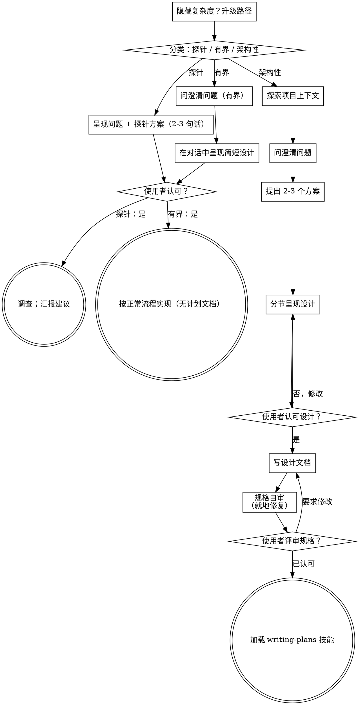

# 把想法头脑风暴为设计

通过自然的协作式对话，把想法变成成型的设计与规格。

先判断这个请求需要多少流程，再沿所选路径推进：理解上下文、打磨想法、
呈现设计，并取得使用者的认可。

## 建立共同理解

头脑风暴的产出，是一份使用者能够辨认、能够纠正的理解，并且扎根于
使用者想要达成的目标。

1. **发现意图。** 用请求本身和已有上下文，判断预期结果是什么、为谁而做、
   以及成功是什么样子。当这些信息缺失时，先就目的或预期用途问一个聚焦的
   问题，再提功能或方案。知道应用属于什么品类，并不能告诉你使用者为什么
   想要它。补齐缺失的需求，不等于要求对方再次授权这项任务。
2. **把你的理解写回去。** 用一段简短说明总结预期结果、相关约束和成功
   标准，让使用者能够评判。把他们说过的和你的假设分开写。请对方纠正，
   并在把这份理解当作设计简报之前先吸收他们的回答。
3. **把意图带入设计。** 把取得共识的理解保留在所选路径的设计产物里：
   架构性工作写进书面规格；有界工作和探针则保留在对话内的设计/探针
   说明中。用这份理解去检验你提出的功能与技术选择。

当请求本身已经给出目的和约束时，复述这份理解，而不是把同样的问题再问
一遍。说明要简短；重要的是它准确，以及使用者有机会纠正它。

<HARD-GATE>
在采取任何实现动作之前——包括加载实现类技能、编写产品代码、搭建脚手架、
安装产品依赖，或创建外部项目——先完成所选路径的前置条件：

- 探针：使用者认可所提问题和探针方案。
- 有界：使用者认可对话内的简短设计。
- 架构性：使用者评审并认可书面规格，然后评审书面实现计划并选择其执行
  方式。对话中的设计认可只允许写规格；书面规格获得认可才允许加载
  writing-plans。

一次回复只认可当时实际呈现的那个阶段。对某个想法或功能范围的认可，
不等于认可尚不存在的产物。从最早的未完成阶段继续；不要把一次认可变成
跳过所选路径其余部分的许可。在这些前置条件尚未完成时，允许对项目做只读
探索。
</HARD-GATE>

## 三条路径

在你问出第一个问题之前，先对请求分类，并把分类结果说出来——"这看起来是
有界改动，所以我在这里给一份简短设计，而不是写规格文档"——这样使用者
可以推翻它：

- **探针（Spike）** —— 一个可行性问题（"我们能不能……""有没有可能……"
  "糙一点也没关系"），它的产出是答案，而不是你要留下的代码。用 2-3 句话
  说明问题和你要试的做法，得到对方点头，然后在正确性允许的范围内以最省的
  方式查清。没有设计文档，没有规格文件。把结论作为建议来汇报；你顺手写出
  的任何东西都要标注为一次性丢弃。
- **有界（Bounded）** —— 对仓库中已经存在的代码或行为做范围清晰的改动：一个新
  开关、一个小接口、一处单文件修复。只了解应用类型还不够——有界意味着
  你要改的那条流程此刻就在仓库里、可以直接读到。如果不存在可改的现有流程，
  这个任务就不是有界的。问那些真正重要的澄清问题，在对话里呈现一份简短
  设计（几句话到几小段），然后立即停下。只有使用者对这份设计说了"是"，
  实现才开始——有界任务的认可门槛，和架构性任务一样硬。没有规格文件，
  没有实现计划文档。

  **文档维护边界：** 纯错字、格式、链接或翻译修正，不改变行为、接口、目标或风险，
  属于已授权的可逆维护时，可跳过 brainstorming 的设计门槛；先读取原文，做最小编辑，
  再检查 diff 和引用。只要改动会改变规则、触发条件、流程或用户可见行为，就回到有界路径，
  把这次设计单独呈现并等待认可。
- **架构性（Architectural）** —— 新项目、新子系统，或者会重新组织组件如何
  拼接、改变他人所依赖接口的改动。走完整流程：提问、方案、分节设计、书面
  规格，然后是 writing-plans 技能。

  如果任务在执行中从维护升级为行为或架构变化，立即停止扩大改动，记录新增误差，
  重新分类并从相应门槛开始；早先对维护动作的授权不自动覆盖升级后的范围。

在两条路径之间拿不准时，选更重的那条。棘轮是单向的：任务进行中发现的隐藏
复杂度会把路径升级——停下来、说出来，然后升级。任何情况下都不中途降级。

## 反模式："太简单了，不需要认可"

每条路径都以"使用者在实现之前认可所需设计"收尾。有界改动可能只需要在
对话里说两句话。一个新建的 todo-list 项目属于架构性，需要书面规格，并交接
给计划编写环节。让产物的分量与所选路径相称；在实现之前完成该路径要求的
各项评审。

## 危险信号

| 想法 | 现实 |
|---------|---------|
| "这个太简单了，不需要设计" | 按所选路径走：有界改动拿一份简短的对话内设计；架构性改动拿书面规格，并交接给计划编写环节。 |
| "我就把它叫作有界，跳过规格" | 抓一个标签来省掉工作，这件事本身就是疑虑——走更重的那条路径。 |
| "它是有界的，设计也显而易见——他们看的时候我就先动手" | 门槛是认可，不是设计的长度。先呈现，然后停下，直到听见"是"。 |
| "我懂这类应用，所以它是有界的" | 有界与否衡量的是仓库，不是你的熟悉程度。新项目没有现有流程——它是架构性的。 |
| "探针跑通了，所以我就把代码留下" | 探针的产出是一个答案。留下代码是一个新请求——重新分类。 |
| "它变大了，但我快做完了——不用重新分类" | 隐藏复杂度会在任务中途把路径升级。停下来，把它说出来。 |
| "他们认可了探针，所以后续改动也算认可了" | 每个任务有自己的分类，也有自己的认可。 |

## 清单

先分类，公布路径，然后用 `todo_write` 为所选路径上的每一项建一条任务，
并按顺序完成。

**探针：**
1. **探索项目上下文** —— 足以框定探针即可
2. **呈现问题 + 探针方案** —— 2-3 句话
3. **取得认可** —— 点个头就够
4. **调查** —— 在正确性允许的范围内尽可能省
5. **汇报结论** —— 一份建议；你写出的任何东西都标注为一次性丢弃

**有界：**
1. **探索项目上下文** —— 查看文件、文档、最近的提交
2. **问澄清问题** —— 一次一个，只问重要的
3. **在对话中呈现简短设计** —— 方案、涉及的文件、测试
4. **取得认可** —— 停下，等待明确的"是"；把呈现设计和开始动手放在同一步，
   就是跳过门槛
5. **实现** —— 按正常开发流程推进（TDD 适用）；没有计划文档

**架构性：**
1. **探索项目上下文** —— 查看文件、文档、最近的提交
2. **问澄清问题** —— 一次一个，理解目的/约束/成功标准
3. **提出 2-3 个方案** —— 附上取舍和你的推荐
4. **呈现设计** —— 分节呈现，每节篇幅与该节复杂度相称，每一节之后取得
   使用者认可
5. **写设计文档** —— 保存到 `docs/superpowers/specs/YYYY-MM-DD-<topic>-design.md` 并提交
6. **规格自审** —— 就地快速检查占位符、矛盾、歧义、范围（见下文）
7. **使用者评审写好的规格** —— 在继续之前请使用者评审规格文件
8. **转入实现** —— 加载 writing-plans 技能，产出实现计划

## 流程总览

**终态由路径决定。** 架构性：头脑风暴之后你唯一加载的技能就是
writing-plans——绝不是 frontend-design、mcp-builder 或任何其它实现类
技能。有界：认可之后，实现直接按正常开发流程推进；没有计划文档。探针：
终态是一份汇报出来的建议。

## 流程

下面各小节服务于有界路径和架构性路径（探针在"呈现探针、得到点头"处就
结束）。从**探索方案**开始的小节是架构性路径的深度——对有界工作而言，
上下文加几个问题再加一份简短的对话内设计，就是全部流程。

**理解想法：**

- 先查看项目的当前状态（文件、文档、最近的提交）
- 在问细节问题之前，先评估范围：如果请求描述了多个相互独立的子系统
  （例如"做一个带聊天、文件存储、计费和分析的平台"），立刻指出来。
  不要把一个需要先拆解的项目，用问题去打磨细节。
- 如果项目大到一份规格装不下，帮使用者把它拆成子项目：哪些是相互独立的
  部分、它们如何关联、应该按什么顺序构建？然后按正常设计流程对第一个
  子项目做头脑风暴。每个子项目都有自己的 规格 → 计划 → 实现 循环。
- 对范围合适的项目，一次问一个问题来打磨想法
- 尽量优先用选择题，开放式问题也可以
- 每条消息只问一个问题——如果某个话题需要更多探索，把它拆成多个问题
- 聚焦于理解：目的、约束、成功标准

**探索方案：**

- 提出 2-3 个不同的方案，并说明各自的取舍
- 用对话的方式呈现选项，附上你的推荐和理由
- 把你推荐的选项放在最前面，并解释为什么
- 无情地执行 YAGNI——从每个方案和设计里删掉不必要的功能

**呈现设计：**

- 当你确信自己理解了要构建的东西，就呈现设计
- 每一节的篇幅与该节的复杂度相称：直白的地方几句话，微妙的地方最多
  200-300 字
- 每讲完一节，问一下到这里为止是否对路
- 覆盖：架构、组件、数据流、错误处理、测试
- 如果有哪里讲不通，随时准备回头澄清

**为隔离与清晰而设计：**

- 把系统拆成更小的单元，每个单元只有一个明确目的、通过定义清晰的接口
  通信，并且可以被独立理解和测试
- 对每个单元，你都应该能回答：它做什么、怎么用它、它依赖什么？
- 别人不读内部实现，能理解这个单元做什么吗？你能改内部实现而不弄坏
  调用方吗？如果不能，边界还需要打磨。
- 更小、边界更清晰的单元对你来说也更好处理——对能一次装进上下文的代码，
  你的推理更可靠；文件聚焦时，你的编辑也更可靠。一个文件变得很大，通常
  说明它承担得太多了。

**在已有代码库中工作：**

- 在提出改动之前先探索现有结构。遵循既有模式。
- 当现有代码存在影响本次工作的问题时（例如文件已经过大、边界不清、
  职责纠缠），把有针对性的改进纳入设计——就像一个好开发者会顺手改善
  自己正在动的代码那样。
- 不要提议无关的重构。始终聚焦于服务当前目标的事。

## 设计之后（架构性路径）

**文档：**

- 把经过验证的设计（规格）写到 `docs/superpowers/specs/YYYY-MM-DD-<topic>-design.md`
  - （使用者对规格存放位置的偏好优先于此默认值）
- 如果可用，使用 elements-of-style:writing-clearly-and-concisely 技能
- 把设计文档提交到 git

**规格自审：**
写完规格文档之后，用新鲜的眼光再看一遍：

1. **占位符扫描：** 有没有"TBD"、"TODO"、未完成的章节或含糊的需求？修掉它们。
2. **内部一致性：** 有没有章节互相矛盾？架构与功能描述是否吻合？
3. **范围检查：** 它是否聚焦到可以用单份实现计划覆盖，还是需要拆解？
4. **歧义检查：** 有没有需求可以被解读成两种不同意思？如果有，选定一种并写明确。

所有问题就地修复。不需要再评审一遍——修完就继续。

**使用者评审门槛：**
规格评审循环通过之后，在继续之前请使用者评审写好的规格：

> "规格已写好并提交到 `<path>`。请你评审一下，如果在我们开始写实现计划之前想做什么修改，告诉我。"

等待使用者的回复。如果他们要求修改，改完之后重新跑一遍规格评审循环。只有
使用者认可之后才继续。

**实现：**

- 加载 writing-plans 技能，产出一份详细的实现计划
- 绝不加载任何其它技能。writing-plans 就是下一步。
