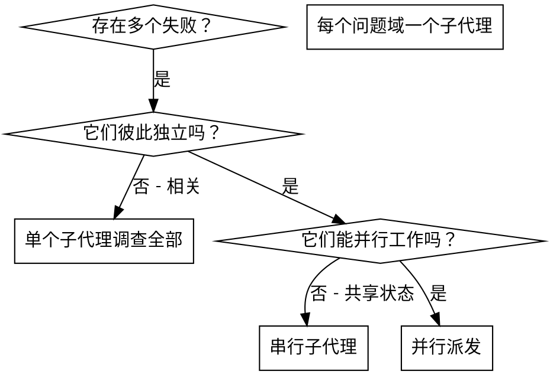

# 派发并行子代理

## 概述

你把任务委派给拥有隔离上下文的专用子代理。通过精确地构造它们的指令与上下文，你能确保它们保持专注并完成自己的任务。它们绝不应当继承你所在会话的上下文或历史 —— 你要为它们精确构造所需的一切。这同时也能为你自己保留用于协调工作的上下文。

当你面对多个互不相关的失败（不同的测试文件、不同的子系统、不同的 bug）时，逐个串行调查会浪费时间。每一次调查都是独立的，可以并行发生。

**核心原则：** 每个独立的问题域派发一个子代理。让它们并发工作。

## 使用时机



**使用时机：**
- 3 个以上测试文件失败，且根因各不相同
- 多个子系统各自独立地损坏
- 每个问题都可以在不依赖其它问题上下文的情况下被理解
- 各次调查之间没有共享状态

**不要使用：**
- 失败彼此相关（修好一个可能连带修好其它）
- 需要理解完整的系统状态
- 子代理之间会互相干扰

## 该模式

### 1. 识别独立的问题域

按"坏在哪里"对失败分组：
- 文件 A 的测试：工具审批流程
- 文件 B 的测试：批量完成行为
- 文件 C 的测试：中止功能

每个问题域都是独立的 —— 修复工具审批不会影响中止相关的测试。

### 2. 创建聚焦的子代理任务

每个子代理拿到：
- **明确范围：** 一个测试文件或子系统
- **清晰目标：** 让这些测试通过
- **约束条件：** 不要改动其它代码
- **预期产出：** 你发现了什么、修复了什么的总结

### 3. 并行派发

在同一个响应里发起全部三个子代理派发 —— 它们会并发执行：

```text
子代理（subagent）："修复 agent-tool-abort.test.ts 的失败"
子代理（subagent）："修复 batch-completion-behavior.test.ts 的失败"
子代理（subagent）："修复 tool-approval-race-conditions.test.ts 的失败"
# 三者并发运行。
```

一个响应里出现多个派发调用 = 并行执行。一个响应里只有一个 = 串行。（DSH 的 `subagent` 默认在后台并发运行：全部派发出去后由各子代理完成后回报，再由你汇总。需要"队长 + 队员 + 任务板"式协作时可改用 Agent Teams：`spawn_teammate` + `team_task_create`/`team_task_update` + `send_message` + `wait_agent`。）

### 4. 评审与整合

当子代理返回时：
- 阅读每一份总结
- 验证修复之间互不冲突
- 运行完整测试套件
- 整合全部改动

## 子代理提示词结构

好的子代理提示词应当：
1. **聚焦** —— 一个清晰的问题域
2. **自包含** —— 包含理解问题所需的全部上下文
3. **对产出有明确要求** —— 子代理应当返回什么？

```markdown
修复 src/agents/agent-tool-abort.test.ts 中 3 个失败的测试：

1. "should abort tool with partial output capture" - 期望消息中出现 'interrupted at'
2. "should handle mixed completed and aborted tools" - 快速工具被中止而不是完成
3. "should properly track pendingToolCount" - 期望 3 个结果，实际得到 0

这些是时序/竞态条件问题。你的任务：

1. 阅读测试文件，理解每个测试在验证什么
2. 定位根因 —— 是时序问题还是真实的 bug？
3. 通过以下方式修复：
   - 用基于事件的等待替换随意的超时
   - 如果发现中止实现里的 bug 就修掉它
   - 如果被测试的行为已经改变，就调整测试期望

不要只是加大超时时间 —— 找到真正的问题。

返回：你发现了什么、修复了什么的总结。
```

## 常见错误

**❌ 过于宽泛：** "修复所有测试" —— 子代理会迷失方向
**✅ 具体：** "修复 agent-tool-abort.test.ts" —— 范围聚焦

**❌ 没有上下文：** "修复这个竞态条件" —— 子代理不知道问题在哪
**✅ 有上下文：** 粘贴报错信息和测试名

**❌ 没有约束：** 子代理可能重构一切
**✅ 有约束：** "不要改动生产代码" 或 "只修复测试"

**❌ 产出含糊：** "修好它" —— 你不知道改了什么
**✅ 具体：** "返回根因与改动的总结"

## 何时不要使用

**相关的失败：** 修好一个可能连带修好其它 —— 先放在一起调查
**需要完整上下文：** 理解问题需要看到整个系统
**探索性调试：** 你还不知道哪里坏了
**共享状态：** 子代理会互相干扰（编辑同一批文件、使用同一批资源）

## 会话中的真实示例

**场景：** 一次大规模重构之后，3 个文件中共有 6 个测试失败

**失败情况：**
- agent-tool-abort.test.ts：3 个失败（时序问题）
- batch-completion-behavior.test.ts：2 个失败（工具没有执行）
- tool-approval-race-conditions.test.ts：1 个失败（执行计数 = 0）

**判定：** 独立的问题域 —— 中止逻辑、批量完成、竞态条件彼此分离

**派发：**
```
子代理 1 → 修复 agent-tool-abort.test.ts
子代理 2 → 修复 batch-completion-behavior.test.ts
子代理 3 → 修复 tool-approval-race-conditions.test.ts
```

**结果：**
- 子代理 1：把超时替换成基于事件的等待
- 子代理 2：修复了事件结构 bug（threadId 放错了位置）
- 子代理 3：增加了等待异步工具执行完成的逻辑

**整合：** 全部修复互相独立、没有冲突，完整套件全绿

## 验证

子代理返回之后：
1. **评审每份总结** —— 理解改了什么
2. **检查冲突** —— 子代理是否编辑了同一处代码？
3. **运行完整套件** —— 验证所有修复能协同工作
4. **抽查** —— 子代理可能犯系统性错误
