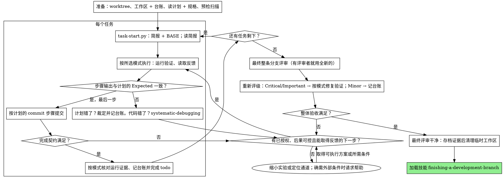

# 执行计划

在本会话里由你自己逐个任务地执行计划：不为每个任务派发实现者子代理，
也不为每个任务派发评审者。整条分支只在最后做一次全新上下文的评审。

**为什么内联：** 子代理驱动开发要为每个任务各付一次全新实现者和全新评审者的
成本，两者都要从零重读代码库。内联执行只付一份上下文（你的）加最后一名评审者。
它放弃的是每个任务一份全新上下文和每个任务一双额外的眼睛。本技能用其它手段
保住这两样买到的东西：简报就是规格，台账就是你的记忆，所选模式的运行证据是每个任务的门禁，
最后那名评审者就是那双额外的眼睛。

**核心原则：** 执行计划，以真实反馈验证每一步，并保留可复核记录。自动模式使用最小真实路径、必要反例与修正回归；运行时模式使用目标实例与同场景反馈，不要求人为制造失败。

**叙述：** 工具调用之间最多用一行短话说明 —— 记录由台账和工具结果承担。

**连续执行：** 在已有授权和必要条件齐备时推进，不在任务之间重复询问。以规格和验收为依据解决局部可逆歧义，台账记录 `裁决：<决定> — <证据与理由> — <影响及失效条件>`。

执行中遇到未知，先读取现有资料、定位运行入口或做最小实验。根据反馈自行调整实现；核对可用通道后仍缺少只能由外部提供的输入、权限或资源时，完成可行准备并提出具体请求。涉及范围扩大或不可逆后果时按现有授权处理。

一次尝试失败也是反馈：用它更新假设，选定并执行下一次最小实验或修正。内部尝试轮次耗尽时换策略；用户或工具的硬预算耗尽才交接。完成仍以验收为准。

## 何时使用

- 你有一份来自技能 `writing-plans` 的计划，并且使用者在交接时选择了内联执行。
- 你的会话没有可用的 `subagent` 工具（子代理被禁用或被策略拒绝）。绝不凭空编造
  派发；就在本会话里执行这份计划。
- 任务大体相互独立 —— 与技能 `subagent-driven-development` 相同的前提。

一份写足细节的计划会让内联执行变成"誊写加测试"：它在中等档位的会话模型上也能
跑得很好，而最强的模型真正值回成本的地方只有最后的评审，本技能把那次评审单独
派发出去。使用者选择内联时，把这一点告诉他们。

当使用者希望每个任务都有评审门禁，或者计划长到靠后的任务会在被压缩的上下文里
运行时，优先用技能 `subagent-driven-development`。长计划上的内联执行依然可行
—— 台账正是让它可恢复的原因 —— 但最后几个任务分到的是你最少的精力。

## 流程



## 准备

确保工作发生在隔离的工作区里：按技能 `using-git-worktrees` 用 `git worktree`
命令创建，或核验已有的 worktree。没有使用者的明确同意，绝不在 main/master 分支上
开始实现。

会话记忆扛不过上下文压缩。一个丢掉位置的执行者会重新实现那些 commit 已经存在的
任务 —— 这和主控会话重复派发是同一个失败，只是代价从你自己的上下文里出。把进度
记在台账文件里，而不是只记在 todo 里。DSH 的 todo（`todo_write`）是实时视图；
台账才是记录。

工作区和台账与技能 `subagent-driven-development` 共用 —— 同一个目录、同一种格式
—— 所以一个计划可以在执行途中更换执行者，新的执行者从同一份台账续上。

本技能和配合技能里的脚本用 `python <脚本>` 调用。

- 运行 `python ../subagent-driven-development/scripts/sdd-workspace.py PLAN_FILE` 定位本计划工作区。脚本与 `plan-path` 只定位产物，不验证需求版本或完成状态。
- 台账第一行是 `# SDD 台账 — 计划：<计划文件路径>`。路径不符的旧台账原样保留；路径相同也不能直接采信 `任务 <N>：完成`。
- **恢复核对：** 比较当前计划/规格版本（提交或内容指纹）、任务文本与验收；确认完成提交仍在当前历史中且效果未被 revert、覆盖或后续改动破坏；检查 HEAD、工作树/索引未提交改动、依赖与配置；核对原始证据的版本、环境与失效条件。缺记录时补核对或聚焦验证。
- 台账记录 `恢复核对：<计划/规格版本>；<任务验收>；<提交与工作树>；<证据及失效条件>；<沿用/重开及理由>`。只有验收证据仍有效的任务才跳过，只重开受影响任务及依赖；不因路径匹配、完成行或提交存在跳过，也不无条件重做有效任务。
- 工作区丢失时可从 git 历史重建线索；历史不能恢复未提交运行日志，缺少的验收证据仍要补齐。

把计划读一遍，记住它的上下文与 Global Constraints，并为每个任务建一条 todo。
如果计划点名了一份规格（Spec），也要读它：规格是计划据以论证的权威，计划内部的
冲突都按规格来解。找不到规格的计划要在台账里留一行说明 —— 没有规格时做出的裁定
都是临时的。

**必需子技能：** 每个任务开始前，核对简报的开发模式并加载对应的 `test-driven-development` 或 `runtime-driven-development`。没有模式时按 `using-superpowers` 选择并记入台账；不得把 TDD 模板强套到运行时任务，也不用重复询问已有授权。

在 Task 1 之前，扫描计划中任务之间的冲突。计划的 Interfaces 块告诉你该看哪些地方：
每一个消费了更早任务产物的任务，都要有一行台账 —— 涉及的两个任务、一方产出什么与
另一方消费什么、以及你发现了什么。彼此不共享任何东西的任务不用记行；如果计划里
所有任务都互不共享，就只记一行 `预备检查：无共享接口`。每一行暴露出的
冲突都要裁定，以规格为有约束力的权威，把裁定记在该行旁边，然后开始 Task 1。每个
任务自身的文字在你看它的简报时检查，不在这里检查。

## 任务循环

你打印的每一样东西、以及每一条工具结果，都会在本次会话余下的时间里常驻你的
上下文。把冗长的测试输出重定向到工作区里的文件再读它的尾部；读简报，不要读整份
计划。

### 1. 接下一个任务

- 运行本技能的 `scripts/task-start.py PLAN_FILE N`。它一次调用就打印简报路径和
  BASE（该任务评审范围所切的 commit）。每个任务的简报都要读，包括你觉得在准备
  阶段已经记住的那些：你记得的只是摘要，简报里才有精确的取值、签名和测试用例。
- 把该任务的 todo 标记为 in_progress。

每一次工具调用都是一次重读你全部上下文的回合。记账要搭着干活的顺风车 —— 台账
追加和 commit 放在同一次调用里，绝不要单独为它开一次调用。

### 2. 走完各步骤

按简报的开发模式顺序执行：两种模式都先复用或跑通最小真实路径，再运行有依据的反例并据反馈修正。现有行为已满足契约就如实记录，不人为造红；观测条件未知时先校准探针。

每一个运行命令的步骤都有一行 `预期：`。运行该命令，读它的输出，然后比对。
三种结果：

- **一致。** 下一步。
- **代码错了。** 用技能 `systematic-debugging`。找出根因；绝不要为了让步骤的
  输出匹配而去修补症状。
- **计划错了** —— 某一步与规格矛盾、更早任务的接口与本任务消费的东西对不上、
  某条命令根本不可能工作。对满足规格的最小改动做裁定，记进台账为
  `任务 <N>：裁决： <发现> — <你决定了什么以及为什么>`，然后继续。裁定是带着走
  的，不是靠记的：后面触碰同一接口的任务会从台账里读到它。

按计划的 commit 步骤提交。一个任务跨多个 commit 没问题；评审范围是从 BASE 切的，
永远不用 `HEAD~1`。

### 3. 完成契约

在写入某个任务的台账行之前，下面每一条都必须成立，而且证据就在本次会话里 ——
不能从 diff 看着没问题推算出来：

- 简报要求的自动检查与实机操作都已实际执行，原始反馈可复核，版本/环境匹配最后改动。
- 自动模式的真实路径、必要反例与回归，或运行时模式的对应实测证据齐全；不能用构建成功或空日志补足。
- 简报里每一行 `预期：` 都与真实输出比对过。
- 对简报的每一处偏离都在台账里有一行 `裁决：`。

**必需子技能：** 技能 `verification-before-completion` 管辖这个声明。任何一条
缺失时继续补齐：运行验证、修复观测通道或调整实现；核查后确需外部条件时再请求帮助。

### 4. 完成任务

先满足上述完成契约。有可执行验证命令时可用下面的 `task-done.py`，但它只证明该命令的结果，不能替代手动实机验收。涉及手动 UI/设备操作时，核对原始记录后在同一台账写明 `任务 <N>：完成（commits <base7>..<head7>，runtime: <实例/场景> → <实际结果>，evidence: <记录位置>）`；缺反馈则记录未完成。不得用空命令或打印 PASS 伪造脚本成功。

自动命令路径：运行本技能的 `scripts/task-done.py PLAN_FILE N BASE -- <测试命令>`，用简报为整个
任务点名的那条测试命令。它运行测试、把完整输出留在工作区、打印尾部，并且 ——
只有在通过时 —— 才把完成行追加到台账：

`任务 <N>：完成（commits <base7>..<head7>，tests: <command> → <result>）`

失败运行不追加完成行，保留原始输出并记录未完成。脚本写入的完成格式行只记录命令成功，不能自动驱动 todo 或恢复跳过：核对完整验收、计划/规格版本、当前工作树与证据仍有效，再补记验收依据和失效条件，才完成 todo。误用脚本提前写了完成行时，追加更正为未完成，不掩盖旧记录。

## 最终评审

运行 `../subagent-driven-development/scripts/review-package.py PLAN_FILE MERGE_BASE HEAD`
（MERGE_BASE = 分支起始的 commit，例如 `git merge-base main HEAD`），从它打印的
文件开始评审。

**有 `subagent` 工具时：** 用当前可用的最强模型派发评审者 —— 整条分支的评审是
判断类任务 —— 使用技能 `requesting-code-review` 的
[code-reviewer.md](../requesting-code-review/code-reviewer.md)，带上评审包路径、
计划和规格的路径、计划若有 Review Focus 一节就原样附上（计划测试没有覆盖的输入
类别与失败模式 —— 评审者会逐条刻意检查），并指出台账里 `裁决：` 各行的位置，
好让它权衡你做过的判断。派发时显式指定 `model`；不指定模型会继承会话的模型，
而它未必是最强的。这是整轮运行唯一买到的全新上下文。不要跳过它，也不要用你自己
读一遍 diff 来替代。

**没有 `subagent` 工具时：** 读 code-reviewer.md，自己对着评审包做那次评审，作为
最后一个任务台账行之后的一次独立过一遍。把
`Final review: self-review (no subagent tool)` 写进台账，并在最终消息里说明这点：
作者自评审比全新评审者弱，够不够在合并前过关，由使用者决定。

先区分实际缺陷、约定验收的证据缺口和可选增强。评审者的严重度是建议，由你依据可达触发路径、代码或运行依据与用户后果作出决定；明确的代码错误无需等实际事故再修。缺少验收记录就补对应验证，没有具体依据的假想故障不扩成防御任务或裁决清单。规格遗漏的真实问题仍按影响处理，普通可逆选择沿现有契约推进。然后：

- **Critical 和 Important** 进入修复轮。
- **Minor** 以 `终稿：次要（暂缓）： <一句话>` 记入台账，并写进你最终消息的
  "推迟的 Minor"（Deferred minors）之下。Minor 永远不进修复轮，也永远不变成裁定
  —— 裁定是对冲突的决定，不是一条你拒绝了润色建议的备注。

Critical 和 Important 的发现由你按该任务的开发模式修复并实际验证。自动模式留真实路径、反例结果与修正回归；运行时模式留实例症状、根因证据与同场景复测，不补造失败。运行项目要求的回归，把模式、场景/命令与原始记录位置记入台账。未验证不能写成已处理，套件通过也不能外推没有其它问题；已有证据足够时不重复派发评审。

任何轮次都可以凭证据驳回误报，记录 `终稿：裁决：<发现> — <反证与适用版本> — <影响>`；不为等上限做无效修复。争议未解不能当作已驳回。默认一次集中修复作为本轮预算；残留或新发现按后果和当前验收依赖重评，严重问题不因最终轮或位于修复 diff 外而消失。已超预算却尚未满足验收时记录未完成并安排下一步，不进入交付；无严重后果且不影响当前验收的独立改进可暂缓。

## 收尾

在你删除任何东西之前，把台账里每一行含 `裁决：` 的内容收集到最终消息的
"我做过的裁定"（Rulings I made）之下，按你做裁定的顺序排列，每条都带上错了的代价；
并把每一行 `minor (deferred)` 收集到"推迟的 Minor"（Deferred minors）之下。两份
清单都必须是穷尽的。你替使用者做出的决定 —— 以及你选择不处理的发现 —— 只有最终
消息这一个地方能到达他们那里。

清理前把台账与原始验证记录存档到可长期访问、不会随计划工作区或 worktree 删除的位置，核对报告中的引用仍可打开。提交历史只保留已提交内容，不能代替未提交的日志/实机操作记录；存档未完成就保留工作区。最终评审干净、修复已提交且证据已存档后，才删除本计划的临时工作区。相邻目录属于别的计划；别碰它们。

加载技能 `finishing-a-development-branch`。

## 常见自我合理化

| 借口 | 现实 |
|--------|---------|
| "我记得 Task N 说了什么" | 你记得的是摘要。简报里才有精确的取值。去读它。 |
| "计划的代码是对的，跳过看测试失败" | 你从没看它失败过的测试什么都证明不了。那只是一个步骤。去运行它。 |
| "我在最后跑整套测试，不用每步都跑" | 逐步运行才能让你知道是哪个步骤弄坏的。任务结束时的运行是契约，不是替代品。 |
| "计划这里错了，我直接做对的事就好" | 做对的事，并把裁定记进台账。没记台账的偏离是暗地里的决定。 |
| "我过几个任务再补台账行" | 上下文压缩不会等你方便的时候。一个任务一行，和 commit 在同一条消息里。 |
| "下一个任务之前让我确认一下" | 他们选内联就是为了少花成本。进度询问花的是他们自己的时间。缺少必要输入、授权或能力时只暂停依赖步骤，独立已授权工作继续。 |
| "我自己仔细读过 diff 了，最终评审者是多余的" | 同一个作者，同一批盲点。评审者是这轮运行唯一买到的全新上下文。 |
| "测试应该能过，改动很小" | "应该"不是证据。契约要求命令和它的输出。 |
| "子代理又慢又贵，最终评审我也跳过" | 内联已经去掉了每任务的评审者。对整条分支做一次评审是下限，不是上限。 |
| "评审者说有风险，就都加防御" | 先核对可达触发路径、依据与后果。处理具体缺陷，不把猜测升级成门禁。 |
| "修复很明显，不用运行验证" | 需要目标路径与必要反例的实际结果；修复已有故障还需同场景复测。diff 与静态推演都不能证明已修复。 |
| "来都来了，把 Minor 也一起修了" | 你每修一个 Minor，都是使用者没要求的一次测试、一次修复和一次套件运行。记进台账；由使用者决定。 |

## 示例工作流（TDD）

```
你：我正在用 executing-plans 技能内联实现这份计划。

[准备：worktree 已核验]
[读计划一遍：docs/superpowers/plans/feature-plan.md；规格已读]
[解析工作区：sdd-workspace.py docs/superpowers/plans/feature-plan.md —— 里面没有台账，全新开始]
[预检扫描：2 行共享接口、4 行自洽性，干净；已写入台账]
[为所有任务创建 todo]

Task 1: Git hook 安装脚本

[task-start.py plan 1 → 简报已读；BASE a1b2c3d]
[步骤 1：写失败的测试 —— 已写]
[步骤 2：运行它 —— FAIL：install_hook 未定义。与 Expected 一致。]
[步骤 3：实现 —— 已写]
[步骤 4：运行它 —— PASS 1/1。与 Expected 一致。]
[步骤 5：commit —— d4e5f6a]
[契约：计划/规格 v1；任务验收与当前工作树匹配；原始证据可复核、无偏离]
[task-done.py plan 1 a1b2c3d -- npm test -- hooks → 命令通过并追加完成格式行]
[核对完整验收，补记计划/规格 v1、evidence task-1-tests.log 及接口/配置变化会使证据失效；再完成 todo]

Task 2: 恢复模式

[task-start.py plan 2 → 简报已读；BASE d4e5f6a]
[步骤 2：运行失败的测试 —— FAIL，但错在 import：Task 1 导出
 installHook，简报消费 install_hook]
[裁定：简报里的消费方名字相对 Task 1 的 Produces 块是笔误；
 用 installHook —— 台账：任务 2：裁决： install_hook → installHook — 与 Task 1 的 Produces 一致 — 错了的代价：一次重命名]
[步骤 2-5 照计划；commit b7c8d9e]
[task-done.py plan 2 d4e5f6a -- npm test -- recovery → 命令通过；核对完整验收后补记版本、证据及失效条件，再完成 todo]
[若恢复时计划、提交效果、工作树或配置改变：重开受影响验收；不按完成行跳过]

...

[所有任务之后：review-package.py plan MERGE_BASE HEAD；派发 code-reviewer，用最强的模型]
评审者：一条 Important 发现 —— 进度报告间隔被硬编码。两条 Minor。
[重新评级：Important 成立；Minor 们 → 以推迟记入台账]
[修复轮：test_progress_interval_configurable 红 → 抽出 PROGRESS_INTERVAL → 绿；套件 12/12；commit]
[台账：终稿：已修复 hardcoded interval — test_progress_interval_configurable RED→GREEN，套件 12/12]

我做过的裁定：
- Task 2: install_hook → installHook（简报笔误；错了的代价：一次重命名）

推迟的 Minor：
- README 缺少用法示例
- recovery.js 可以把 verify/repair 拆成两个文件

[核对原始证据已存档且引用可打开，再清理本计划临时工作区]

正在加载技能 finishing-a-development-branch。
```
