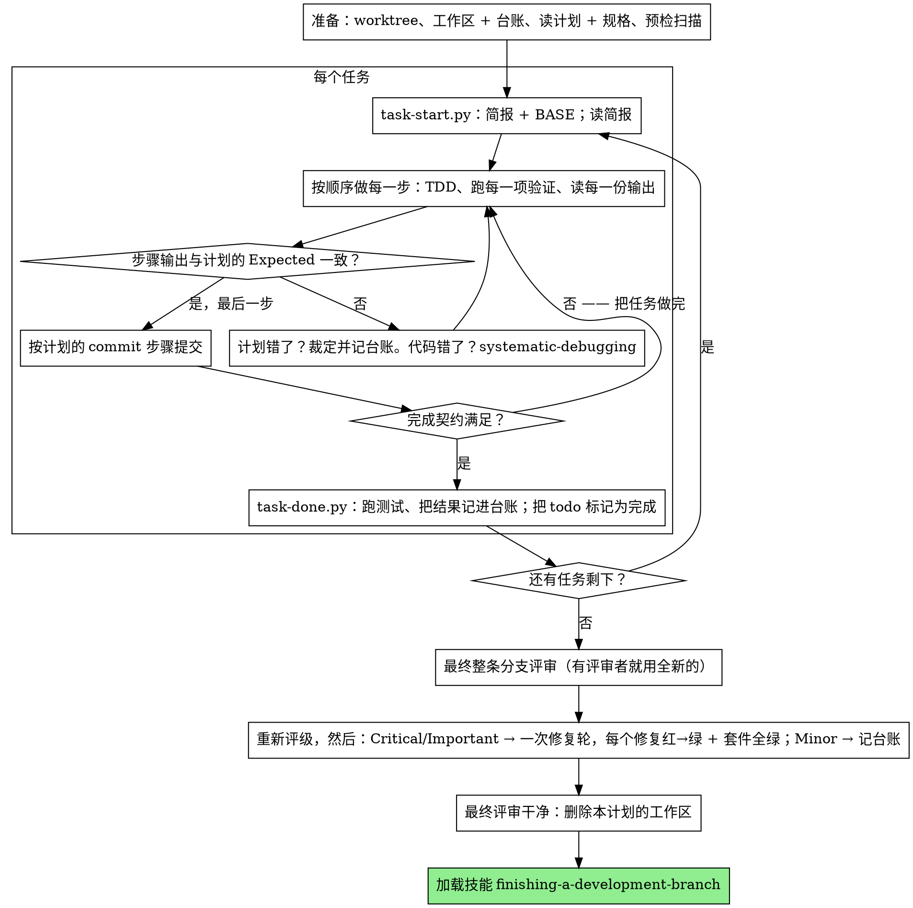

# 执行计划

在本会话里由你自己逐个任务地执行计划：不为每个任务派发实现者子代理，
也不为每个任务派发评审者。整条分支只在最后做一次全新上下文的评审。

**为什么内联：** 子代理驱动开发要为每个任务各付一次全新实现者和全新评审者的
成本，两者都要从零重读代码库。内联执行只付一份上下文（你的）加最后一名评审者。
它放弃的是每个任务一份全新上下文和每个任务一双额外的眼睛。本技能用其它手段
保住这两样买到的东西：简报就是规格，台账就是你的记忆，TDD 是每个任务的门禁，
最后那名评审者就是那双额外的眼睛。

**核心原则：** 思考已经在计划里做完了。精确地执行它，用你亲眼看着它先失败、
再通过的测试来证明每一步，并留下能扛住你自己遗忘的记录。

**叙述：** 工具调用之间最多用一行短话说明 —— 记录由台账和工具结果承担。

**连续执行：** 不要在任务之间停下来找使用者确认。他们选择内联执行是为了少花
成本，不是为了在每个任务之后回答"要不要继续？"。不中断地执行计划里的所有任务。

**做裁定，不要卡住。** 冲突、歧义、计划缺陷 —— 都由你来决断。规格是有约束力的
权威，计划是它对规格的论证，两者都答不上来的地方由你的判断来定。把每个决定都
记进台账，格式为 `裁决：<你决定了什么> — <为什么> — <错了的代价>`，然后继续
推进。没有在台账里留下裁定的偏离，就是在暗地里做决定。

有四件事会让你停下来，仅此四件：不可逆或破坏性操作；安全敏感的动作；本 worktree
之外、按惯例应先询问的副作用（合并、推送到共享分支、发布）；以及计划烂到每一条
前进路线都只能靠猜。遇到这些，停下来发问。

## 何时使用

- 你有一份来自技能 `writing-plans` 的计划，并且使用者在交接时选择了内联执行。
- 你的会话没有可用的 `subagent` 工具（子代理被禁用或被策略拒绝）。绝不凭空编造
  派发；就在本会话里执行这份计划。
- 任务大体相互独立 —— 与技能 `subagent-driven-development` 相同的前提。

一份写足细节的计划会让内联执行变成"誊写加测试"：它在中等档位的会话模型上也能
跑得很好，而最强的模型真正值回成本的地方只有最后的评审，本技能把那次评审单独
派发出去。使用者选择内联时，把这一点告诉他们。

当使用者希望每个任务都有评审门禁，或者计划长到靠后的任务会在被压缩的上下文里
运行时，优先用技能 `subagent-driven-development`。长计划上的内联执行依然可行
—— 台账正是让它可恢复的原因 —— 但最后几个任务分到的是你最少的精力。

## 流程



## 准备

确保工作发生在隔离的工作区里：按技能 `using-git-worktrees` 用 `git worktree`
命令创建，或核验已有的 worktree。没有使用者的明确同意，绝不在 main/master 分支上
开始实现。

会话记忆扛不过上下文压缩。一个丢掉位置的执行者会重新实现那些 commit 已经存在的
任务 —— 这和主控会话重复派发是同一个失败，只是代价从你自己的上下文里出。把进度
记在台账文件里，而不是只记在 todo 里。DSH 的 todo（`todo_write`）是实时视图；
台账才是记录。

工作区和台账与技能 `subagent-driven-development` 共用 —— 同一个目录、同一种格式
—— 所以一个计划可以在执行途中更换执行者，新的执行者从同一份台账续上。

本技能和配合技能里的脚本都是 Python，统一用
`pwsh -Command "python <脚本>"` 启动。

- 每份计划拥有一个工作区：技能开始时运行
  `../subagent-driven-development/scripts/sdd-workspace.py PLAN_FILE` —— 它打印
  该计划被 git 忽略的目录
  （`<repo-root>/.superpowers/sdd/<plan-basename>/`），这里是本计划全部产物的家：
  台账、简报、评审包。别的计划的目录永远不归你读写。
- 在 `<workspace>/progress.md` 检查本计划的台账。如果它的第一行写的是你的计划
  文件，那么带 `任务 <N>：完成` 行的任务就是已完成 —— 不要重做；从第一个没有
  该行的任务接着做。即便你的上下文已经不再记得做过它们，它们对应的 commit 依然
  存在于 git 中：压缩之后，相信台账和 `git log`，而不是你自己的记忆。第一行写着
  别的计划文件的台账，是别的计划的进度：别动它，另起一份属于你自己的新台账。
- 建台账时把它的身份写在第一行：
  `# SDD 台账 — 计划：<计划文件路径>`。
- `git clean -fdx` 会毁掉工作区（它是被 git 忽略的暂存物）；
  真发生了，就从 `git log` 恢复。

把计划读一遍，记住它的上下文与 Global Constraints，并为每个任务建一条 todo。
如果计划点名了一份规格（Spec），也要读它：规格是计划据以论证的权威，计划内部的
冲突都按规格来解。找不到规格的计划要在台账里留一行说明 —— 没有规格时做出的裁定
都是临时的。

**必需子技能：** 就在 Task 1 之前，现在加载技能 `test-driven-development`。它管辖
下面每个任务的每一步；计划里的步骤已经写着"先写失败的测试"，也不能免去你读它的
义务。

在 Task 1 之前，扫描计划中任务之间的冲突。计划的 Interfaces 块告诉你该看哪些地方：
每一个消费了更早任务产物的任务，都要有一行台账 —— 涉及的两个任务、一方产出什么与
另一方消费什么、以及你发现了什么。彼此不共享任何东西的任务不用记行；如果计划里
所有任务都互不共享，就只记一行 `预备检查：无共享接口`。每一行暴露出的
冲突都要裁定，以规格为有约束力的权威，把裁定记在该行旁边，然后开始 Task 1。每个
任务自身的文字在你看它的简报时检查，不在这里检查。

## 任务循环

你打印的每一样东西、以及每一条工具结果，都会在本次会话余下的时间里常驻你的
上下文。把冗长的测试输出重定向到工作区里的文件再读它的尾部；读简报，不要读整份
计划。

### 1. 接下一个任务

- 运行本技能的 `scripts/task-start.py PLAN_FILE N`。它一次调用就打印简报路径和
  BASE（该任务评审范围所切的 commit）。每个任务的简报都要读，包括你觉得在准备
  阶段已经记住的那些：你记得的只是摘要，简报里才有精确的取值、签名和测试用例。
- 把该任务的 todo 标记为 in_progress。

每一次工具调用都是一次重读你全部上下文的回合。记账要搭着干活的顺风车 —— 台账
追加和 commit 放在同一次调用里，绝不要单独为它开一次调用。

### 2. 走完各步骤

计划里的步骤已经按红-绿顺序排好；在准备阶段加载的技能 `test-driven-development`
之下，按这个顺序走。测试步骤的代码要最先写、最先运行。亲眼看着它失败是一个步骤，
不是走过场 —— 一个在实现存在之前就通过的测试，是关于这个测试的一条发现。

每一个运行命令的步骤都有一行 `预期：`。运行该命令，读它的输出，然后比对。
三种结果：

- **一致。** 下一步。
- **代码错了。** 用技能 `systematic-debugging`。找出根因；绝不要为了让步骤的
  输出匹配而去修补症状。
- **计划错了** —— 某一步与规格矛盾、更早任务的接口与本任务消费的东西对不上、
  某条命令根本不可能工作。对满足规格的最小改动做裁定，记进台账为
  `任务 <N>：裁决： <发现> — <你决定了什么以及为什么>`，然后继续。裁定是带着走
  的，不是靠记的：后面触碰同一接口的任务会从台账里读到它。

按计划的 commit 步骤提交。一个任务跨多个 commit 没问题；评审范围是从 BASE 切的，
永远不用 `HEAD~1`。

### 3. 完成契约

在写入某个任务的台账行之前，下面每一条都必须成立，而且证据就在本次会话里 ——
不能从 diff 看着没问题推算出来：

- 简报点名的每一个测试都存在、都在本任务里跑过，而且你读过输出。
- 该任务最后一次测试运行通过了 —— `task-done.py` 就是那次运行，它把命令和结果
  写进台账行。
- 简报里每一行 `预期：` 都与真实输出比对过。
- 对简报的每一处偏离都在台账里有一行 `裁决：`。

**必需子技能：** 技能 `verification-before-completion` 管辖这个声明。任何一条
缺失，任务就不算完成：去把它做完。

### 4. 完成任务

运行本技能的 `scripts/task-done.py PLAN_FILE N BASE -- <测试命令>`，用简报为整个
任务点名的那条测试命令。它运行测试、把完整输出留在工作区、打印尾部，并且 ——
只有在通过时 —— 才把完成行追加到台账：

`任务 <N>：完成（commits <base7>..<head7>，tests: <command> → <result>）`

失败的一次运行什么都不记；任务不算完成。当它记下了，就把 todo 标记为完成，
接下一个任务。

## 最终评审

运行 `../subagent-driven-development/scripts/review-package.py PLAN_FILE MERGE_BASE HEAD`
（MERGE_BASE = 分支起始的 commit，例如 `git merge-base main HEAD`），从它打印的
文件开始评审。

**有 `subagent` 工具时：** 用当前可用的最强模型派发评审者 —— 整条分支的评审是
判断类任务 —— 使用技能 `requesting-code-review` 的
[code-reviewer.md](../requesting-code-review/code-reviewer.md)，带上评审包路径、
计划和规格的路径、计划若有 Review Focus 一节就原样附上（计划测试没有覆盖的输入
类别与失败模式 —— 评审者会逐条刻意检查），并指出台账里 `裁决：` 各行的位置，
好让它权衡你做过的判断。派发时显式指定 `model`；不指定模型会继承会话的模型，
而它未必是最强的。这是整轮运行唯一买到的全新上下文。不要跳过它，也不要用你自己
读一遍 diff 来替代。

**没有 `subagent` 工具时：** 读 code-reviewer.md，自己对着评审包做那次评审，作为
最后一个任务台账行之后的一次独立过一遍。把
`Final review: self-review (no subagent tool)` 写进台账，并在最终消息里说明这点：
作者自评审比全新评审者弱，够不够在合并前过关，由使用者决定。

在动手处理任何一条发现之前，先给它们分档。评审者给的严重级别只是建议；门禁在你
手里。它的"拒绝判断"（Declined to judge）清单同样归你：那里的每一行都是你要做出
并记入台账的裁定，和计划冲突完全一样 ——
`终稿：裁决： <评审者搁置的行为> — <一个讲理的人用上这软件会得到什么，这为什么
站得住、或者为什么它现在成了一条发现> — <错了的代价>`。先按影响重新评级：规格是
一份愿景文档，一条发现的级别取决于它发布后一个讲理的人用上这软件会得到什么，而
不取决于规格有没有点名触发它的输入 —— 评审者因为规格没提就把一条发现定成 Minor，
那是给规格评级，不是给影响评级。然后：

- **Critical 和 Important** 进入修复轮。
- **Minor** 以 `终稿：次要（暂缓）： <一句话>` 记入台账，并写进你最终消息的
  "推迟的 Minor"（Deferred minors）之下。Minor 永远不进修复轮，也永远不变成裁定
  —— 裁定是对冲突的决定，不是一条你拒绝了润色建议的备注。

Critical 和 Important 的发现由你自己修 —— 这里你就是实现者 —— 一次修完。每个修复
都由 TDD 验证，而不是由第二位评审者：写出能复现该发现的测试，看着它失败，让它通过，
然后跑整套测试。每个修复都记入台账为
`终稿：已修复 <发现> — <测试名> RED→GREEN，套件 <N>/<N>`。没有先失败过的测试，
修复就不算验证过；修复轮之后套件不是全绿，就说明这一轮还没结束。不要派发复评审：
那会重读一份 diff，而它的覆盖测试已经回答了"已处理"，它的套件运行也已经回答了
"什么都没弄坏"。

你决定不修的一条发现就是一次裁定 —— `终稿：裁决： <发现> —
<代码为什么站得住> — <错了的代价>` —— 它会通过裁定清单到达使用者那里。不存在
第二轮修复。

## 收尾

在你删除任何东西之前，把台账里每一行含 `裁决：` 的内容收集到最终消息的
"我做过的裁定"（Rulings I made）之下，按你做裁定的顺序排列，每条都带上错了的代价；
并把每一行 `minor (deferred)` 收集到"推迟的 Minor"（Deferred minors）之下。两份
清单都必须是穷尽的。你替使用者做出的决定 —— 以及你选择不处理的发现 —— 只有最终
消息这一个地方能到达他们那里。

当最终评审干净、它的修复也已提交，删除本计划的工作区目录 —— 现在记录在 git 历史
里。相邻目录属于别的计划；别碰它们。

加载技能 `finishing-a-development-branch`。

## 常见自我合理化

| 借口 | 现实 |
|--------|---------|
| "我记得 Task N 说了什么" | 你记得的是摘要。简报里才有精确的取值。去读它。 |
| "计划的代码是对的，跳过看测试失败" | 你从没看它失败过的测试什么都证明不了。那只是一个步骤。去运行它。 |
| "我在最后跑整套测试，不用每步都跑" | 逐步运行才能让你知道是哪个步骤弄坏的。任务结束时的运行是契约，不是替代品。 |
| "计划这里错了，我直接做对的事就好" | 做对的事，并把裁定记进台账。没记台账的偏离是暗地里的决定。 |
| "我过几个任务再补台账行" | 上下文压缩不会等你方便的时候。一个任务一行，和 commit 在同一条消息里。 |
| "下一个任务之前让我确认一下" | 他们选内联就是为了少花成本。进度询问花的是他们自己的时间。只有那四件事能让你停。 |
| "我自己仔细读过 diff 了，最终评审者是多余的" | 同一个作者，同一批盲点。评审者是这轮运行唯一买到的全新上下文。 |
| "测试应该能过，改动很小" | "应该"不是证据。契约要求命令和它的输出。 |
| "子代理又慢又贵，最终评审我也跳过" | 内联已经去掉了每任务的评审者。对整条分支做一次评审是下限，不是上限。 |
| "评审者说 Minor，那就是 Minor" | 那个标签给规格的沉默评了级。给人实际得到的东西评级。先重新评级，再决定门禁。 |
| "修复很明显，不用先写失败的测试" | 失败的测试是这条发现真实存在、且现在已消失的唯一证明。没有它，你只有一份 diff 和一点希望。 |
| "来都来了，把 Minor 也一起修了" | 你每修一个 Minor，都是使用者没要求的一次测试、一次修复和一次套件运行。记进台账；由使用者决定。 |

## 示例工作流

```
你：我正在用 executing-plans 技能内联实现这份计划。

[准备：worktree 已核验]
[读计划一遍：docs/superpowers/plans/feature-plan.md；规格已读]
[解析工作区：sdd-workspace.py docs/superpowers/plans/feature-plan.md —— 里面没有台账，全新开始]
[预检扫描：2 行共享接口、4 行自洽性，干净；已写入台账]
[为所有任务创建 todo]

Task 1: Git hook 安装脚本

[task-start.py plan 1 → 简报已读；BASE a1b2c3d]
[步骤 1：写失败的测试 —— 已写]
[步骤 2：运行它 —— FAIL：install_hook 未定义。与 Expected 一致。]
[步骤 3：实现 —— 已写]
[步骤 4：运行它 —— PASS 1/1。与 Expected 一致。]
[步骤 5：commit —— d4e5f6a]
[契约：测试跑过、输出读过、无偏离]
[task-done.py plan 1 a1b2c3d -- npm test -- hooks → 台账：Task 1: complete (commits a1b2c3d..d4e5f6a, tests: npm test -- hooks → 1/1 pass)]

Task 2: 恢复模式

[task-start.py plan 2 → 简报已读；BASE d4e5f6a]
[步骤 2：运行失败的测试 —— FAIL，但错在 import：Task 1 导出
 installHook，简报消费 install_hook]
[裁定：简报里的消费方名字相对 Task 1 的 Produces 块是笔误；
 用 installHook —— 台账：任务 2：裁决： install_hook → installHook — 与 Task 1 的 Produces 一致 — 错了的代价：一次重命名]
[步骤 2-5 照计划；commit b7c8d9e]
[task-done.py plan 2 d4e5f6a -- npm test -- recovery → 台账：Task 2: complete (commits d4e5f6a..b7c8d9e, tests: npm test -- recovery → 8/8 pass)]

...

[所有任务之后：review-package.py plan MERGE_BASE HEAD；派发 code-reviewer，用最强的模型]
评审者：一条 Important 发现 —— 进度报告间隔被硬编码。两条 Minor。
[重新评级：Important 成立；Minor 们 → 以推迟记入台账]
[修复轮：test_progress_interval_configurable 红 → 抽出 PROGRESS_INTERVAL → 绿；套件 12/12；commit]
[台账：终稿：已修复 hardcoded interval — test_progress_interval_configurable RED→GREEN，套件 12/12]

我做过的裁定：
- Task 2: install_hook → installHook（简报笔误；错了的代价：一次重命名）

推迟的 Minor：
- README 缺少用法示例
- recovery.js 可以把 verify/repair 拆成两个文件

[删除本计划的工作区 —— 记录现在住在 git 里]

正在加载技能 finishing-a-development-branch。
```
