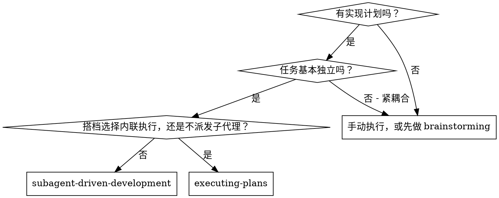
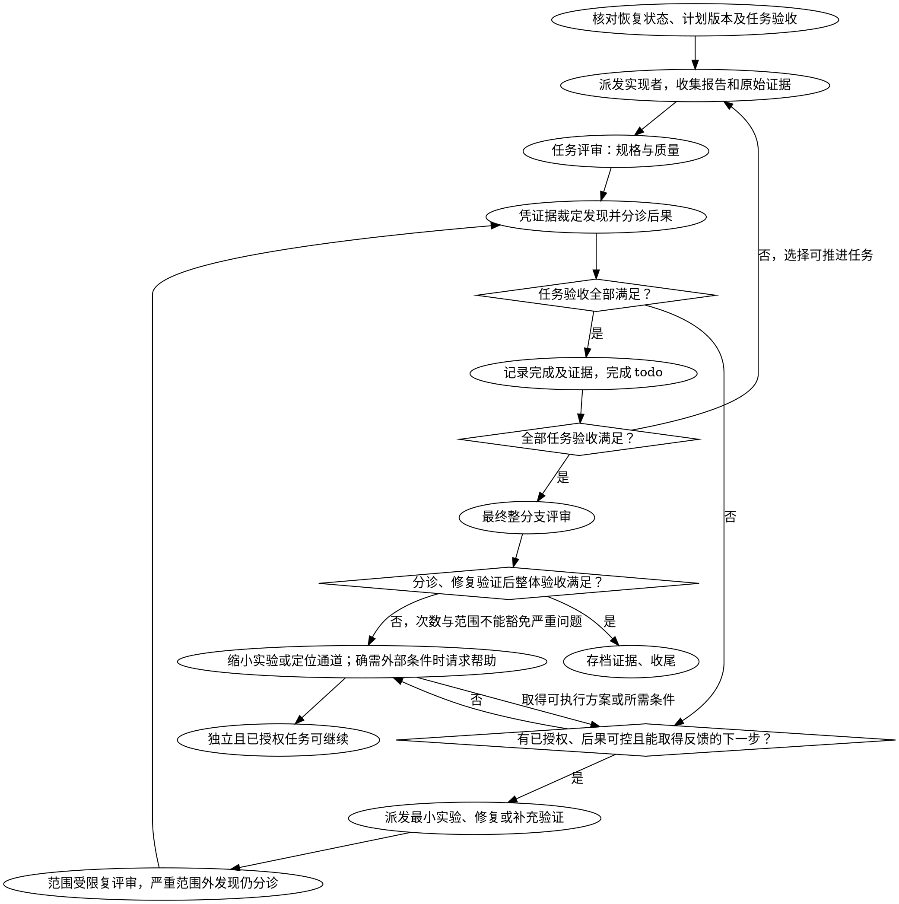

# 子代理驱动开发

按任务逐个派发全新的实现者子代理来执行计划，每个任务之后做一次任务评审（规格符合性 + 代码质量），最后做一次整分支的宽口径评审。

**为什么用子代理：** 你把任务委派给上下文隔离的专门代理。通过精确构造它们的指令与上下文，你保证它们保持聚焦并完成自己的任务。它们绝不继承你所在会话的上下文或历史——你精确构造出它们所需的一切。这同时也把你自己的上下文留给协调工作。

**核心原则：** 每个任务一个全新子代理 + 任务评审（规格 + 质量）+ 最后的宽口径评审 = 高质量、快速迭代

**叙述：** 工具调用之间最多叙述一行短句——台账和工具结果才是记录。

**持续执行：** 在已有授权和必要条件齐备时推进计划，不在任务之间重复询问“要不要继续”。完成由验收证据决定，轮次或预算只限制本轮投入。

**依据证据裁决。** 在授权范围内解决可逆的局部歧义，以规格为约束、计划为实现方案。把决定记入台账：`裁决：<决定> — <证据与理由> — <影响与失效条件>`。遇到未知先查资料、定位通道或执行实验；核查后确需外部输入或访问时提交具体请求，独立工作继续。涉及不可逆后果、范围扩大或外部副作用时先核对已有授权，只有授权确实不足才请求补充。不得用自行裁决降低验收要求。

## 何时使用



**对比「执行计划」（内联）：**
- 每个任务一个全新子代理（不污染上下文），而不是一个上下文做完全部任务
- 每个任务之后都评审（规格符合性 + 代码质量），而不是只在最后评审
- 代价是每个任务、每次评审都要一个新上下文；内联只花一个上下文加一个最终评审者
- 两者都在当前会话里运行，共用同一份计划工作区与台账，按依赖推进已授权工作

## 流程



## 准备

确保工作在隔离的工作区里进行：用 using-git-worktrees 技能创建，或核对已存在的工作区。绝不在没有搭档明确同意的情况下在 main/master 分支上开始实现。

对话记忆熬不过压缩。在真实会话里，丢失位置的会话主控曾把整个已完成的任务序列重新派发一遍——这是观察到的最昂贵的失败。把进度记在台账文件里，不要只记在 todo。

- 每个计划拥有一个工作区：技能开始时运行本技能的
  `python scripts/sdd-workspace.py PLAN_FILE` —— 它打印该计划的 git 忽略目录（在
  `<repo-root>/.superpowers/sdd/` 下），这是属于这个计划的全部产物的家：
  台账、简报、报告、评审包。别的计划的目录永远不归你读或写。
- 工作区脚本与 `plan-path` 标记只定位产物，不证明计划版本相同或任务已完成。台账第一行使用 `# SDD 台账 — 计划：<计划文件路径>`；路径不符的台账原样保留，不挪用进度。
- **恢复核对：** 读取当前计划与规格，比较台账记录的版本（提交或内容指纹）、任务文本与验收；核对完成提交仍在当前历史中且其效果未被 revert、覆盖或后续改动破坏；检查当前 HEAD、未提交工作树/索引、依赖与配置，以及证据适用的版本、环境和失效条件。
- 只有上述核对表明验收和证据仍有效，才跳过对应任务。路径相同、存在 commit 或有 `任务 <N>：完成` 行都不足以跳过。缺少记录就补核对或聚焦验证；变更只重开受影响任务及依赖，不重做仍有效的部分。恢复修复循环时也先重评未决发现与已消耗预算，不盲目从下一轮重试。
- 台账是恢复线索，不是当前事实的替代品。记录 `恢复核对：<计划/规格版本>；<任务验收>；<当前提交与工作树>；<证据位置及失效条件>；<沿用/重开及理由>`。工作区丢失时从提交历史重建线索，并补齐不能从 git 恢复的验证记录。

把计划读一遍，记下它的上下文与 Global Constraints，并用 `todo_write` 为每个任务建一条 todo。如果计划点名了某个 Spec，也把它读了：规格是计划据以立论的权威，计划内部的冲突按规格裁决。找不到可读规格的计划要在台账里记一条说明——没有规格时作出的裁决都是临时的。

在派发任务 1 之前，把计划扫一遍找冲突，边查边写下你查了什么：

- 任务之间互相矛盾，或任务与计划的 Global Constraints 矛盾
- 计划明确要求、但评审准则会当成缺陷的东西（什么都不校验的测试、逻辑块的逐字复制）

扫描的输出是一张表，不是一个结论。每一对共享文件或接口的任务占一行：两个任务分别是什么、一个产出什么而另一个消费什么、你发现了什么。每个任务各占一行：它自己的文本是否自洽——它规定的测试对它所规定的代码、它创建的文件对它后面又要触碰的文件。没有这些行的“扫描干净”不算你扫过。

把表写进台账。在执行开始之前对你发现的一切作出裁决——每条发现都针对要求它的计划文本——并把每条裁决记入台账。若扫描干净，不作评述直接继续。对它暴露的每个冲突作出裁决——规格是约束性权威，计划是它的论证——把裁决记在对应行旁边，然后派发任务 1。评审循环仍然是兜住「只有实现才会暴露的冲突」的网。

## 传递开发模式

任务简报必须包含开发模式与验证场景；缺失时按 `using-superpowers` 选择并记入台账。给实现者和评审者传同一模式：TDD 交有效 RED→GREEN，运行时模式交目标实例、探针/断言、同场景及交付配置的实测证据。不能因运行时任务没有先行自动化测试就要求删实现或判定未遵守流程。无实机证据仍不能宣布完成。

## 模型选择

用能胜任每个角色的最弱模型，以节省成本并提高速度。

**机械性实现任务**（孤立的函数、清晰的规格、1-2 个文件）：用快而便宜的模型。当计划写得好时，大多数实现任务都是机械性的。

**集成与判断类任务**（多文件协调、模式匹配、调试）：用标准模型。

**架构与设计任务**：用可用的最能干的模型。最终的整分支评审就属于这类——用可用的最能干的模型派发它，而不是用会话默认模型。

**评审任务**：按同样的判断选模型，并随 diff 的规模、复杂度与风险缩放。小的机械 diff 不需要最能干的模型；微妙的并发改动则需要。针对小修复 diff 的范围受限复评审，用便宜到中档的模型。

**修复循环重评（第 4-5 轮）**：先核对失败证据；若能力或视角不足的假设有依据且可用，再换更能干的模型。升级是一次干预，不是根因结论。

**派发子代理时永远显式指定模型。** 省略模型会继承你所在会话的模型——往往是能力最强也最贵的那个——这会静默地抵消本节的作用。

**轮次数比 token 价格更重要。** 墙钟时间与上下文成本随子代理消耗的轮次数增长，而最便宜的模型在多步工作上经常花 2-3 倍轮次——总体反而更贵。把中档模型当作评审者和「照着散文式描述干活的实现者」的下限。当任务的计划文本里已包含要写的完整代码时，实现就是转录加测试：这种实现者用最便宜的一档。单文件的机械修复也用最便宜的一档。

**任务复杂度信号（实现任务）：**
- 只碰 1-2 个文件且有完整规格 → 便宜模型
- 碰多个文件且涉及集成问题 → 标准模型
- 需要设计判断或对代码库的广泛理解 → 最能干的模型

## 任务循环

**把同形的小活批量处理。** 当计划里列了若干任务，每个都是同类的小型独立改动——同一处单行修复、同一个常量修改、同一个字段新增，在多个文件里重复——不要一个任务派发一个子代理。写一份派发简报，列出每个文件及其改动，整批交给一个子代理，并把它的 diff 当做一个整体来评审。一个任务一次派发，只留给那些需要自己的判断、自己的测试或自己的评审面的工作。

你粘进派发提示词的每样东西——以及子代理回传打印的每样东西——都会在你的上下文里驻留到会话结束，并在之后每一轮被重新读一遍。把产物以文件形式交接。

**等待已派发的子代理：** 绝不用短超时轮询等待接口，也绝不干坐在一次无声、无界的等待里。当你还有本地工作——更新台账、打包下一份评审、读报告——就继续干活；后台子代理的结果会自己到达，完成时你会收到通知。当你确实无事可做时，按有界的时间段等待（在你所用平台上允许的范围内，五到十分钟），每段之间发一行状态并盘点还活着的子代理：把它们列出来（`list_agents`），对已经结束却没回报的逐个追问。有界等待保留了长等待几乎全部的效率，同时保证卡住或走丢的子代理在几分钟内被发现，而不是等到会话结束。需要「队长 + 队员 + 任务板」式协作时，也可以改用 DSH 原生 Agent Teams（`spawn_teammate` / `team_task_create` / `team_task_update` / `send_message` / `wait_agent`）。

### 1. 派发实现者

派发之前记录 BASE（`git rev-parse HEAD`）——评审包与修复轮次的 diff 需要它。

- **任务简报：** 派发实现者之前，运行本技能的
  `python scripts/task-brief.py PLAN_FILE N` —— 它把任务的完整文本抽取到一个
  唯一命名的文件并打印该路径。组织派发时让简报保持为需求的
  唯一来源。你的派发内容应包含：(1) 一行说明该任务在项目中的位置；(2) 简报路径，介绍语是“先读这个——它是你的需求，其中的确切取值要原样使用”；
  (3) 简报不可能知道的、来自更早任务的接口与决定；(4) 你对简报中任何歧义的
  裁定；(5) 报告文件路径与报告契约。确切取值（数字、
  魔法字符串、签名、测试用例）只出现在简报里。绝不要让子代理去读整个计划文件。
- **报告文件：** 按简报给实现者的报告文件命名
  （简报 `…/task-N-brief.md` → 报告 `…/task-N-report.md`），并把路径放进派发提示词。实现者把完整报告写在那里，只回传状态、提交、一行测试摘要与顾虑。
- 一份派发提示词描述的是一个任务，不是会话的历史。不要
  把累积的往期任务摘要（“任务 1-3 之后的状态”）粘贴进
  后续派发里——有个真实会话的派发达到 42k 字符，其中 99%
  是粘贴的历史。全新的子代理需要的是它的任务、它触碰的接口
  以及全局约束。别的都不要。
- 派发里带着「不许派生子代理」的契约（它就在
  实现者模板里）：实现者绝不派发子代理——不派帮手，
  也绝不派评审者。评审由你在报告之后送达。在真实会话里，
  工人自己派的每一个评审者都在重复主控本来就派了的任务评审——
  每个任务多出一整份评审席位。
- 如果更早的任务在这个任务要碰的区域里搁置过一条发现，把
  指向那条台账记录的指针带进派发里。
- 从派发结果里记下实现者的代理身份——
  修复循环第 1-3 轮要恢复这个代理。
- 绝不并行派发多个实现子代理（会冲突）。

模板：[implementer-prompt.md](implementer-prompt.md)（用 `subagent` 派发：独立上下文，只回传结果；刻意不用 `subagent_fork`——子代理绝不继承你的会话上下文）

### 2. 处理报告

实现者子代理会报告四种状态之一。分别妥善处理：

**DONE：** 生成评审包（`python scripts/review-package.py PLAN_FILE BASE HEAD`，在本技能目录下运行——它打印自己写入的唯一文件路径；BASE 是你在派发实现者之前记录的那个提交——绝不是 `HEAD~1`，那会静默丢掉多提交任务里除最后一个之外的全部提交），然后带着打印出的路径派发任务评审者。

**DONE_WITH_CONCERNS：** 先核对验收是否真的满足。存在正确性缺口、必要验证缺失或超范围未决项时重分类为未完成；只有不影响当前验收的剩余观察可记录后进入评审。

**NEEDS_CONTEXT：** 实现者需要没有提供的信息。补上缺失的上下文并重新派发。

**BLOCKED：** 实现者无法完成该任务。评估阻塞点：
1. 如果是上下文问题，补充更多上下文并用同一个模型重新派发
2. 如果任务需要更多推理，用更能干的模型重新派发
3. 如果任务太大，拆成更小的块
4. 如果计划本身是错的，对更正作出裁决，记入台账，并把裁决带进派发重新派发

**绝不**无视升级请求，也绝不强迫同一个模型在没有任何改变的情况下重试。如果实现者说自己卡住了，那就得有东西改变。

如果实现者提问——开始之前或任务进行中——清楚而完整地回答，需要时补充上下文，不要催它赶紧去实现。

### 3. 评审任务

逐任务评审是任务范围的闸门。宽口径评审只在最后整分支评审时做一次。绝不跳过任务评审，也绝不接受缺少任一项结论的报告——规格符合性与任务质量两者都必需。实现者自评审永远替代不了任务评审；两者都需要。

- 把 diff 作为文件交给评审者：运行本技能的
  `python scripts/review-package.py PLAN_FILE BASE HEAD` 并把它打印的文件路径
  交给评审者（或者不用脚本：把该区间的 `git log --oneline`、`git diff --stat`
  与 `git diff -U10` 重定向到一个唯一命名的文件）。输出永远不进你自己的上下文，评审者则
  在一次 `read` 调用里看到提交列表、统计摘要和带上下文的完整 diff。
  用你在派发实现者之前记录的 BASE——
  绝不是 `HEAD~1`，它会静默截断多提交任务。绝不在没有 diff 文件的情况下
  派发任务评审者。
- **评审者输入：** 任务评审者拿到三个路径——同一个简报
  文件、报告文件、评审包——外加约束该任务的全局
  约束。
- 你交给评审者的全局约束块就是它的注意力透镜。把约束性要求
  从计划的 Global Constraints 一节或规格里逐字复制过来：确切取值、确切格式，以及
  组件之间声明的关系（“与 X 相同的布局”、“与 Y 匹配”）。评审者的模板
  已经带上了流程规则（YAGNI、
  测试卫生、评审方法）——约束块是给「这个项目的规格」所要求的东西用的。
- 不要在没有具体、针对该任务的理由时添加开放式指令，比如“检查所有使用处”或“如果
  有用就跑一下竞态测试”
- 不要要求评审者重跑实现者已经在同一份代码上跑过的测试——实现者的报告
  就带着测试证据
- 不要为评审者预先判定发现——绝不指示评审者忽略或不报
  某个具体问题。如果你认为某条发现会是假阳性，让评审者提出来，
  在评审循环里裁定。如果你正在写的提示词里出现“不要报”、
  “不要把 X 当成缺陷”、“最多算 Minor”，或者“是计划选的”——停下：你正在
  预先判定，通常是为了给自己省掉一轮评审。
任务评审者可能报出「⚠️ 无法从 diff 验证」的条目——那些要求位于未改动的代码里，或跨任务。
这些不阻塞评审的其余部分，但你必须在把任务标为完成之前自己逐条解决：你掌握计划
与跨任务的上下文，评审者没有。如果你确认某条是真缺口，就按规格评审失败处理——
它与其他发现一起进入修复循环。

模板：[task-reviewer-prompt.md](task-reviewer-prompt.md)（用 `subagent` 派发：独立上下文，只回传结果）

### 4. 修复循环

规格缺口、真实 Critical/Important 问题或约定验收证据缺失，需要处理。每次收到发现先核对具体路径、证据、当前验收及依赖：

- **证据已排除的误报：** 任何轮次都可立即裁定驳回，记录原发现、反证与适用版本；不为耗满轮次派发无效修复。争议尚未解决不等于误报，补能区分判断的聚焦证据。
- **与计划冲突：** 以规格为约束，在现有授权内裁定最小修正并记录；缺少必要决定时暂停相应依赖，不自行降低要求。
- **不影响当前验收、无严重后果且无当前依赖的次要项：** 记录为暂缓，注明后续处理位置；不进入本轮修复。严重度由后果决定，不由文件位置或轮次决定。
- **真实验收缺口或严重问题：** 修复并验证；缺少必要输入、授权或能力时记录未完成并暂停依赖步骤。独立已授权任务可继续。

一个修复轮次是一次修复派发加一次聚焦复评审。默认每任务五轮作为本轮投入预算，允许更早因无新证据或反馈异常而重评。

**第 1-3 轮：** 用 `send_message` 恢复原实现者，传递未决发现及新证据；原代理不可继续时使用新上下文，带简报、报告和发现清单。没有新信息或策略变化，不原样重试。

**第 4-5 轮：** 重评需求、观测通道、环境、方法和能力假设；若换模型能检验其中的假设，向新实现者交代已尝试动作、结果及待验证假设。不能从轮次或更强模型仍失败推导“结构性失败”或“架构根因”。

**每轮验证：** 实现者按原任务模式修复并追加报告。TDD 提供覆盖测试、命令和原始输出；运行时模式提供修复版本/目标实例、实际操作、同场景及交付配置复测反馈。项目必需检查保留，已有反馈足够时不无理由重复整套运行。

**复评审范围：** 运行 `python scripts/review-package.py PLAN_FILE FIX_BASE HEAD`，其中 FIX_BASE 是上次评审看到的 head，使用 [re-review-prompt.md](re-review-prompt.md) 传发现、简报、报告和 diff。验证原发现及修复引入的破坏。范围外发现仍按可达后果与当前验收依赖分诊：危及安全、数据完整性或当前验收的发现立即列为阻塞项；无此影响的独立改进留后续。范围限制控制搜索成本，不屏蔽已经发现的严重问题，最终复评审同样适用。

每轮记入台账：`任务 <N>：修复轮次 <R>/5；已处理/误报已驳回/未决：<发现与证据>；commits <base>..<head>；下一步：<动作>`。

**尝试未收敛：** 利用失败结果缩小实验、换观测点或调整方法，再执行下一步。内部轮次用于重选策略；仍有可控且已授权的反馈动作时继续。用户或工具的硬预算耗尽，或核查后确认需要外部输入时，提交已完成部分与具体请求。验收未满足的任务保持未完成。

### 5. 完成任务

仅在当前任务验收满足、必要评审发现已经修复或被证据驳回、必需验证与原始记录对应当前版本时，写 `任务 <N>：完成（计划/规格版本 <版本>；commits <base>..<head>；验收 <结果>；evidence <路径>）` 并完成 todo。允许记录不影响验收的后续项，不能用“已搁置”替代验收。

未满足时记录具体差距与下一步并执行，todo 保持进行中。核查后确需外部条件才记为受阻，并提出具体请求；独立任务继续。只有版本或环境变化会影响证据时，补记对应失效条件。

## 最终评审

最终整分支评审同样拿到一个包：运行
`python scripts/review-package.py PLAN_FILE MERGE_BASE HEAD`（MERGE_BASE = 分支起始的那个提交，例如 `git merge-base main HEAD`），并把打印出的路径放进最终评审的派发里，这样最终评审者只读一个文件，而不必用 git 命令重新推导分支 diff。用 `subagent` 在可用的最能干的模型上派发（见模型选择），使用 requesting-code-review 技能里的 [code-reviewer.md](../requesting-code-review/code-reviewer.md)。把它指向台账里的暂缓次要项与搁置行，让它分诊哪些必须在合并前修掉。

最终发现按上述规则分诊，默认把需修复项合并为一次修复派发，再做一次范围受限复评审，避免逐条重建上下文。此为本轮预算，不是验收豁免。若残留或新发现涉及严重后果、当前验收或交付依赖，保持未完成并重评下一步；不能因“最后一轮”或位于 diff 外而直接转入交付。只有整体必需验收与评审均满足，才进入收尾和 finishing-a-development-branch。

## 收尾

在删除任何东西之前，收集每一条包含 `裁决：` 的台账行——预检裁决、搁置的发现、断路器裁定，全部——放进你最终消息的「我作出的裁决」一节，按你作出的顺序排列，每条附上错了要付的代价。这份清单是穷尽的：台账里有一条裁决，清单里就必须有它。这份清单是你替搭档作出的决定送达他们的唯一途径——他们读它，然后返修你弄错的部分。一条随工作区一起消失的裁决，就是秘密作出的决定。

清理前把台账、报告与原始验证记录存档到可长期访问、不会随计划工作区或 worktree 删除的位置，并核对引用可打开；git 历史不能代替未提交的日志或实机操作记录。存档未完成就保留工作区。最终整分支评审干净、修复已合入且证据已存档后，才删除本计划的临时工作区。同级目录属于别的计划；别碰它们。

使用 finishing-a-development-branch 技能。

## 常见的自我合理化

| 借口 | 事实 |
|--------|---------|
| “规格符合性上差不多就行” | 真实规格缺口尚未解决就没做完；证据明确的误报随时裁定，验收通过后完成。 |
| “我自己修，派发是额外开销” | 主控自己修会污染你的上下文并跳过评审。恢复实现者。 |
| “再来一轮就收敛了” | 预算耗尽触发重评；次数不证明根因，先找能区分假设的新反馈。 |
| “反正评审者总能找出新问题” | 范围限制控制搜索；已发现的严重问题或当前验收依赖仍须处理，独立次要项留后续。 |
| “这条发现明显是错的，我丢掉了” | 任何轮次都按证据裁定误报，记录反证和适用版本，不静默丢弃。 |
| “修复很小，跳过复评审吧” | 未被评审的修复正是回归落地的方式。每一轮都以一次范围受限的复评审收尾。 |
| “评审拖慢了循环” | 没有评审的循环只是未被验证的空转。评审是循环的刹车与转向。 |
| “台账记账是额外开销” | 台账才是熬过压缩的东西。没有台账的主控曾把整个已完成的任务序列重新派发一遍。 |
| “实现者自己派了个评审者——白多一层保障” | 那是重复席位在评审同一份 diff；任务评审才是闸门。工人自己派的评审者是该标记的缺陷，不是严谨。 |

## 示例工作流

```
你：我在用「子代理驱动开发」执行这个计划。

[准备：worktree 已核对]
[把计划文件读一遍：docs/superpowers/plans/feature-plan.md]
[解析工作区：python scripts/sdd-workspace.py docs/superpowers/plans/feature-plan.md —— 里面没有台账，全新开始]
[用 todo_write 为所有任务建 todo]

任务 1：CLI 安装脚本

[为任务 1 运行 task-brief.py；带简报 + 报告路径 + 上下文派发实现者]

实现者：“开始之前——安装目录应该放在用户级还是系统级？”

你：“用户级（~/.dsh/）”

实现者：[稍后]
  - 实现了 install 命令
  - 补了测试，5/5 通过
  - 自评审：发现漏了 --force 标志，已补上
  - 已提交

[运行 python scripts/review-package.py PLAN_FILE BASE HEAD；带打印出的路径派发任务评审者]
任务评审者：规格 ✅ - 全部要求都已满足，没有多余内容。
  优点：测试覆盖好，代码干净。问题：无。任务质量：通过。

[核对计划/规格 v1、当前工作树与原始验证记录；验收和评审满足]
[台账：任务 1：完成（计划/规格 v1；commits a1b2c3d..d4e5f6a；验收通过；evidence task-1-report.md；失效条件：接口或配置改变）]

任务 2：恢复模式

[为任务 2 运行 task-brief.py；带简报 + 报告路径 + 上下文派发实现者]

实现者：[没有提问]
  - 增加了 verify/repair 模式
  - 8/8 测试通过
  - 已提交

[运行 python scripts/review-package.py PLAN_FILE BASE HEAD；带打印出的路径派发任务评审者]
任务评审者：规格 ❌：
  - 缺失：进度上报（规格写着“每 100 个条目上报一次”）
  问题（Important）：魔法数字（100）

[修复轮次 1：把两条发现发回给实现者，恢复它]
实现者：加了进度上报，抽出了 PROGRESS_INTERVAL 常量。
  重跑 test/recovery.test.js —— 10/10 通过。修复报告已追加。

[运行 python scripts/review-package.py PLAN_FILE FIX_BASE HEAD；派发范围受限的复评审]
复评审者：缺进度上报 —— 已处理（src/recovery.js:41）。
  魔法数字 —— 已处理（src/recovery.js:7）。新增破坏：无。
  结论：所有发现都已处理。

[台账：任务 2：修复轮次 1/5（2 已处理，0 未决；commits d4e5f6a..b7c8d9e）]
[台账：任务 2：完成（计划/规格 v1；commits d4e5f6a..b7c8d9e；验收通过；evidence task-2-report.md；失效条件：恢复路径或配置改变）]

[内部轮次用完仍有缺口：换方法执行最小实验；硬预算耗尽或确缺外部条件时交接]
[若压缩后恢复：核对当前计划、提交效果、工作树与证据有效性，再沿用完成记录]

...

[所有任务之后]
[运行 python scripts/review-package.py PLAN_FILE MERGE_BASE HEAD；用最能干的模型派发最终代码评审者]
最终评审者：全部要求都已满足。暂缓的次要项已分诊：没有阻塞合并的。

[核对原始证据已存档且引用可打开，再清理本计划临时工作区]

完成！使用 finishing-a-development-branch 技能。
```
