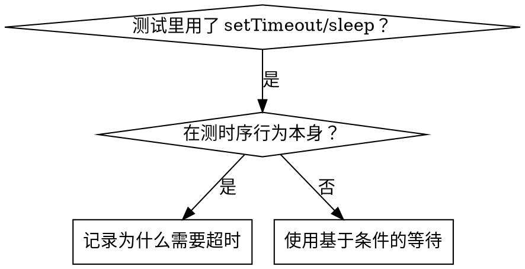

# 基于条件的等待

## 概述

不稳定的测试常常用任意时长的延迟去猜时序。这会造出竞态条件：测试在快机器上通过，一上负载或 CI 就失败。

**核心原则：** 等待你真正关心的那个条件，而不是猜测它要多久。

## 使用时机



**以下情况使用：**
- 测试里有任意的延迟（`setTimeout`、`sleep`、`time.sleep()`）
- 测试不稳定（有时通过，负载一大就失败）
- 测试并行运行时超时
- 等待异步操作完成

**以下情况不要使用：**
- 在测真实的时序行为（防抖、节流间隔）
- 如果确实用了任意超时，永远要记录清楚原因

## 核心模式

```typescript
// ❌ 之前：猜时序
await new Promise(r => setTimeout(r, 50));
const result = getResult();
expect(result).toBeDefined();

// ✅ 之后：等待条件
await waitFor(() => getResult() !== undefined);
const result = getResult();
expect(result).toBeDefined();
```

## 常用模式

| 场景 | 模式 |
|----------|---------|
| 等待事件 | `waitFor(() => events.find(e => e.type === 'DONE'))` |
| 等待状态 | `waitFor(() => machine.state === 'ready')` |
| 等待数量 | `waitFor(() => items.length >= 5)` |
| 等待文件 | `waitFor(() => fs.existsSync(path))` |
| 复合条件 | `waitFor(() => obj.ready && obj.value > 10)` |

## 实现

通用的轮询函数：
```typescript
async function waitFor<T>(
  condition: () => T | undefined | null | false,
  description: string,
  timeoutMs = 5000
): Promise<T> {
  const startTime = Date.now();

  while (true) {
    const result = condition();
    if (result) return result;

    if (Date.now() - startTime > timeoutMs) {
      throw new Error(`Timeout waiting for ${description} after ${timeoutMs}ms`);
    }

    await new Promise(r => setTimeout(r, 10)); // 每 10ms 轮询一次
  }
}
```

本目录里的 `condition-based-waiting-example.ts` 给出了完整实现，包含来自真实调试会话的领域专用辅助函数（`waitForEvent`、`waitForEventCount`、`waitForEventMatch`）。

## 常见错误

**❌ 轮询过快：** `setTimeout(check, 1)` —— 浪费 CPU
**✅ 修法：** 每 10ms 轮询一次

**❌ 没有超时：** 条件永远不满足时会死循环
**✅ 修法：** 永远设置超时，并给出清晰的报错

**❌ 数据过时：** 在循环外把状态缓存下来
**✅ 修法：** 在循环内调用取值函数，拿到新鲜数据

## 什么时候任意超时才是对的

```typescript
// 工具每 100ms 跳一次 —— 需要 2 跳才能验证部分输出
await waitForEvent(manager, 'TOOL_STARTED'); // 先：等待条件
await new Promise(r => setTimeout(r, 200));   // 再：等待有确定时序的行为
// 200ms = 100ms 间隔下的 2 跳 —— 有记录、有依据
```

**要求：**
1. 先等待触发条件
2. 基于已知的时序（不是猜的）
3. 注释说明为什么

## 真实世界的影响

来自调试会话（2025-10-03）：
- 修复了 3 个文件里 15 个不稳定的测试
- 通过率：60% → 100%
- 执行时间：快了 40%
- 不再有竞态条件
