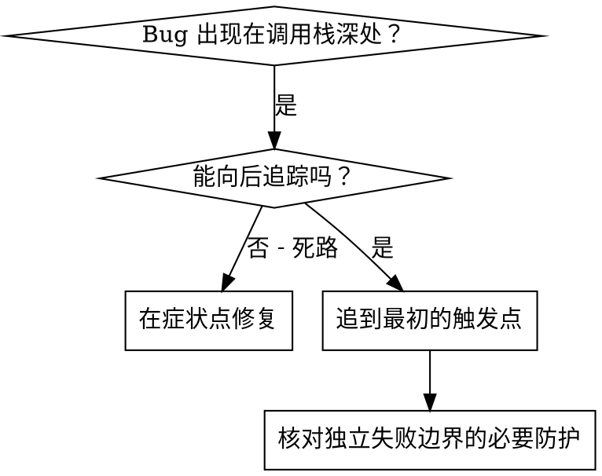
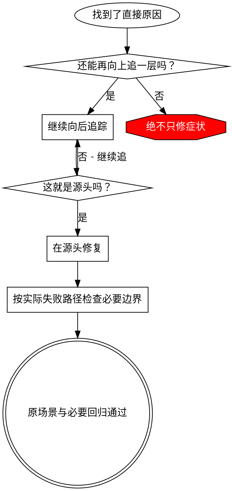

# 根因追踪

## 概述

Bug 往往在调用栈深处才显现（在错误的目录里执行 git init、文件被创建到错误的位置、用错误的路径打开数据库）。你的本能是去修报错出现的地方，但那只是在处理症状。

**核心原则：** 沿着调用链一路向后追，直到找到最初的触发点，然后在源头修复。

## 使用时机



**以下情况使用：**
- 错误发生在执行深处（不在入口点）
- 调用栈显示出很长的调用链
- 不清楚非法数据源自哪里
- 需要找出是哪个测试/哪段代码触发了问题

## 追踪流程

### 1. 观察症状
```
Error: git init failed in ~/project/packages/core
```

### 2. 找到直接原因
**哪段代码直接导致了它？**
```typescript
await execFileAsync('git', ['init'], { cwd: projectDir });
```

### 3. 追问：什么调用了这里？
```typescript
WorktreeManager.createSessionWorktree(projectDir, sessionId)
  → 由 Session.initializeWorkspace() 调用
  → 由 Session.create() 调用
  → 由 Project.create() 里的测试调用
```

### 4. 继续向上追
**传进来的是什么值？**
- `projectDir = ''`（空字符串！）
- 空字符串作为 `cwd` 会解析成 `process.cwd()`
- 那正是源码目录！

### 5. 找到最初的触发点
**空字符串是从哪来的？**
```typescript
const context = setupCoreTest(); // 返回 { tempDir: '' }
Project.create('name', context.tempDir); // 在 beforeEach 之前就访问了！
```

## 添加调用栈

手工追不动时，就加埋点：

```typescript
// 在有问题的操作之前
async function gitInit(directory: string) {
  const stack = new Error().stack;
  console.error('DEBUG git init:', {
    directory,
    cwd: process.cwd(),
    nodeEnv: process.env.NODE_ENV,
    stack,
  });

  await execFileAsync('git', ['init'], { cwd: directory });
}
```

**关键：** 测试里用 `console.error()`（不要用 logger —— 它可能不显示）

**运行并抓取：**
```python
import subprocess

# 运行测试，只保留调试行（等价于 npm test 2>&1 | grep 'DEBUG git init'）
result = subprocess.run(["npm", "test"], capture_output=True, text=True, check=False)
for line in (result.stdout + result.stderr).splitlines():
    if "DEBUG git init" in line:
        print(line)
```

**分析调用栈：**
- 找测试文件名
- 找到触发调用的行号
- 识别模式（同一个测试？同一个参数？）

## 找出是哪个测试造成了污染

如果某样东西在测试过程中出现了，但你不知道是哪个测试：

用本目录里的二分脚本 `find-polluter.py`：

```powershell
pwsh -Command "python ./find-polluter.py '.git' 'src/**/*.test.ts'"
```

它逐个运行测试，在第一个污染源处停下。用法见脚本本身。

## 真实示例：空的 projectDir

**症状：** `.git` 被创建在 `packages/core/`（源码目录）里

**追踪链：**
1. `git init` 在 `process.cwd()` 里执行 ← cwd 参数为空
2. WorktreeManager 被传入空的 projectDir
3. Session.create() 传入了空字符串
4. 测试在 beforeEach 之前访问了 `context.tempDir`
5. setupCoreTest() 初始返回 `{ tempDir: '' }`

**根因：** 顶层变量初始化时访问了空值

**修复：** 把 tempDir 改成 getter，在 beforeEach 之前访问就抛错

**根据实际失败路径决定额外防护：**
- 外部入口尚未校验目录时，在入口建立契约；内部已校验数据直接使用。
- 若有独立路径能绕过校验，在那个边界补检查，不沿调用链逐层复制。
- 测试隔离确有目录限制时，将守卫留在测试执行边界；调查调用栈按需启用并清理。
- 原场景与相关回归满足后即可收尾，源头修复不自动产生新增生产防御的任务。

## 关键原则



**绝不只修错误出现的地方。** 向后追踪，找到最初的触发点。

## 调用栈技巧

**测试中：** 用 `console.error()` 而不是 logger —— logger 可能被屏蔽
**操作之前：** 在危险操作之前记录，而不是等它失败之后
**带上上下文：** 目录、cwd、环境变量、时间戳
**捕获调用栈：** `new Error().stack` 会显示完整的调用链

## 真实世界的影响

来自调试会话（2025-10-03）：
- 通过 5 层追踪找到根因
- 在源头修复（getter 校验）
- 加了 4 层防御
- 1847 个测试通过，零污染
