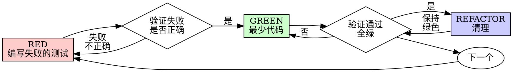

# 测试驱动开发（TDD）

## 概述

TDD 是控制论在代码内层的闭环：用失败测试暴露误差，用最少实现缩小误差，用验证反馈决定下一步。

**完整顺序：** 探测实际场景的最小闭环 → 写出可观察的失败测试 → 看着它因正确原因失败 → 写最少代码 → 验证通过 → 重构并扩展下一个闭环。

先做足够的探测来确定“谁在什么输入下得到什么结果”，再开始正式 TDD。探测只用于澄清目标和反馈通道，产物是一次性的；探测代码不得作为生产代码或“参考实现”保留。

**核心原则：** 如果你没有亲眼看着测试失败，你就不知道它测的是不是正确的东西；如果你没有先确认实际场景和可观察结果，测试可能会精确地收敛到错误目标。

**违背规则的字面，就是违背规则的精神。**

## 何时使用

**先建立最小闭环：**

在写生产代码或正式测试之前，回答四个问题：

1. **场景：** 哪个真实使用者、调用方或故障输入触发行为？
2. **结果：** 对方能观察到什么成功、失败或副作用？
3. **通道：** 用哪个用户级、契约级、集成级或单元级观测证明结果？
4. **边界：** 当前只覆盖哪一个最小行为，哪些扩展留到后续？

如果场景、结果或反馈通道未知，做一个有界探针：读取现有流程、运行真实输入，或写一次性实验。探针失败只说明目标或观测仍不清楚，不进入 GREEN；删掉探针，修正理解后重新开始。

最小闭环通常先从一条真实场景的外层测试开始，再逐步补充内层单元测试和边界场景。外层测试证明系统目标，内层测试缩小定位范围；任何一层都不能替代另一层的验收。

**永远：**
- 新功能
- Bug 修复
- 重构
- 行为变更

**例外（询问使用者）：**
- 一次性原型
- 生成的代码
- 配置文件

想着"就这一次跳过 TDD"？停下。那是自我合理化。

## 铁律

```
没有先确认最小实际闭环，绝不开始正式实现
没有先失败的测试，绝不写生产代码
```

探测阶段可以先运行现有代码或写一次性实验，因为它的目的不是实现功能，而是识别场景、结果和反馈通道。探测完成后必须删除实验产物；从正式失败测试开始，严格执行下面的规则。

测试之前先写了代码？删掉它。从头开始。

**没有例外：**
- 不要把它留作"参考"
- 不要在写测试的过程中"改造"它
- 不要去看它
- 删除就是删除

从正式失败测试出发，全新实现；探测产物不属于这条规则的例外。

## 红-绿-重构



### RED - 编写失败的测试

写一个最小的测试，展示应该发生什么。

<Good>
```typescript
test('重试失败的操作 3 次', async () => {
  let attempts = 0;
  const operation = () => {
    attempts++;
    if (attempts < 3) throw new Error('fail');
    return 'success';
  };

  const result = await retryOperation(operation);

  expect(result).toBe('success');
  expect(attempts).toBe(3);
});
```
名称清晰，测的是真实行为，只做一件事
</Good>

<Bad>
```typescript
test('重试能工作', async () => {
  const mock = jest.fn()
    .mockRejectedValueOnce(new Error())
    .mockRejectedValueOnce(new Error())
    .mockResolvedValueOnce('success');
  await retryOperation(mock);
  expect(mock).toHaveBeenCalledTimes(3);
});
```
名称含糊，测的是 mock 而不是代码
</Bad>

**要求：**
- 一个行为
- 名称清晰
- 真实代码（除非万不得已，否则不要用 mock）

### 验证 RED - 看着它失败

**强制要求。绝不跳过。**

在 DSH 中运行测试命令（用 `run_code`；本仓库约定禁用 PowerShell）：

```bash
npm test path/to/test.test.ts
```

确认：
- 测试失败（不是报错）
- 失败信息符合预期
- 失败的原因是功能缺失（而不是笔误）

**测试通过了？** 你在测已有的行为。修测试。

**测试报错了？** 修掉错误，重跑，直到它正确地失败。

### GREEN - 最少代码

写最简单的代码让测试通过。

<Good>
```typescript
async function retryOperation<T>(fn: () => Promise<T>): Promise<T> {
  for (let i = 0; i < 3; i++) {
    try {
      return await fn();
    } catch (e) {
      if (i === 2) throw e;
    }
  }
  throw new Error('unreachable');
}
```
刚好够通过
</Good>

<Bad>
```typescript
async function retryOperation<T>(
  fn: () => Promise<T>,
  options?: {
    maxRetries?: number;
    backoff?: 'linear' | 'exponential';
    onRetry?: (attempt: number) => void;
  }
): Promise<T> {
  // YAGNI
}
```
过度设计
</Bad>

不要添加功能、不要重构其它代码、不要超出测试去"改进"。

### 验证 GREEN - 看着它通过

**强制要求。**

```bash
npm test path/to/test.test.ts
```

确认：
- 测试通过
- 其它测试仍然通过
- 输出干净（没有错误、没有警告）

**测试失败？** 修代码，不是修测试。

**其它测试失败？** 现在就修。

**"其它测试"指的是项目的整套测试，而不只是你那个文件。** 你写的那一个测试跑绿，不等于整套测试是绿的。在宣布改动完成之前，运行项目的测试命令（裸的 `pytest`、`npm test`、`cargo test` —— 仓库用什么就用什么），即使你的任务只点名了一个测试文件。任务里的范围说明约束的是交付物，不是你的验证。那次运行暴露出的任何失败 —— 包括不是你造成的失败 —— 都要在报告里逐条点名；一条你看着它滚过去却只字未提的红色测试，等于一份靠隐瞒伪造出来的报告。

### REFACTOR - 清理

只在变绿之后：
- 消除重复
- 改进命名
- 抽取辅助函数

保持测试绿色。不要添加行为。

### 重复

为下一个功能写下一个失败的测试。

## 好测试

| 质量 | 好 | 坏 |
|---------|------|-----|
| **最小** | 只做一件事。名字里出现"和"？拆开它。 | `test('validates email and domain and whitespace')` |
| **清晰** | 名字描述行为 | `test('test1')` |
| **体现意图** | 展示期望的 API | 让人看不出代码应该做什么 |

在编写或修改任何测试时，读 [writing-good-tests.md](writing-good-tests.md)，了解让测试保持诚实的那些规则：
- 在写测试之前，先点明会让这个测试失败的那处生产代码改动
- 断言真实行为，绝不断言 mock 行为
- 把只服务于测试的代码放进测试工具，不要放进生产类
- 在 mock 一个依赖之前，先弄清它的副作用

## 常见的自我合理化

| 借口 | 现实 |
|--------|---------|
| "太简单了，不用测" | 简单的代码也会坏。写个测试只要 30 秒。 |
| "我事后再补测试" | 事后写的测试会立刻通过 —— 而这什么也证明不了。它们可能测错了东西、测的是实现而不是行为，或者漏掉你忘掉的那个边界情况。你从没看着它失败过，所以从没证明过它能抓住 bug。测试先行强制你看到那次失败。 |
| "事后补测试达成同样的目标（重精神不重仪式）" | 事后写的测试回答"它做什么？"；测试先行回答"它应该做什么？"。事后写的测试被你已经写好的代码带偏 —— 你验证的是你还记得的那些情况，而不是你本该发现的情况。有覆盖率，却没有测试确实有效的证明。 |
| "我已经手动测过了" | 手动测试是临时的：没有记录你覆盖了什么，代码一变就没法重跑，压力之下容易漏掉情况。"我试的时候是好的" ≠ 全面。自动化测试每次都按同样的方式运行。 |
| "删掉 X 小时的工作太浪费" | 沉没成本谬误 —— 那些时间无论怎么选都已经花掉了。真正的选择是：用 TDD 重写（高信心）vs. 留着它再事后硬贴测试（低信心，大概率有 bug）。留着你无法信任的代码才是浪费。 |
| "留作参考，先写测试" | 你会忍不住改造它。那就是事后测试。删除就是删除。 |
| "我需要先探索一下" | 如果场景、结果或反馈通道确实未知，做有界且一次性的探针；探针结束后删除产物，从失败测试开始。若闭环已清楚，直接进入 RED。 |
| "测试难写 = 设计不清晰" | 听测试的话。难测 = 难用。 |
| "TDD 会拖慢我" | TDD 就是务实之路：在 commit 之前抓住 bug、防止回归、让你能放心重构。"务实"的捷径意味着在生产环境里调试 —— 更慢，而不是更快。 |
| "手动测更快" | 手动测试证明不了边界情况。每次改动你都得重测。 |
| "已有代码没有测试" | 你正在改进它。为已有代码补上测试。 |

## 危险信号 - 停下并重新开始

- 在闭环未知时把探针代码当成生产实现
- 探针结束后保留或改造探针代码
- 测试之前先写了生产代码
- 实现之后才补测试
- 测试立刻通过
- 说不清测试为什么失败
- 测试"以后再加"
- 为"就这一次"找理由
- "我已经手动测过了"
- "事后补测试能达到同样的目的"
- "重精神，不重仪式"
- "留作参考"或"改造现有代码"
- "已经花了 X 小时，删掉太浪费"
- "TDD 太教条，我这样才务实"
- "这次不一样，因为……"

**以上所有情况都意味着：删掉代码。用 TDD 重新开始。**

## 示例：Bug 修复

**Bug：** 空邮箱被接受

**RED**
```typescript
test('拒绝空邮箱', async () => {
  const result = await submitForm({ email: '' });
  expect(result.error).toBe('Email required');
});
```

**验证 RED**
```bash
$ npm test
FAIL: expected 'Email required', got undefined
```

**GREEN**
```typescript
function submitForm(data: FormData) {
  if (!data.email?.trim()) {
    return { error: 'Email required' };
  }
  // ...
}
```

**验证 GREEN**
```bash
$ npm test
PASS
```

**REFACTOR**
如有需要，把校验抽出来以支持多个字段。

## 验证清单

在把工作标记为完成之前：

- [ ] 每个新函数/方法都有测试
- [ ] 在实现之前，亲眼看着每个测试失败
- [ ] 每个测试都因预期原因失败（功能缺失，而不是笔误）
- [ ] 为让每个测试通过写了最少的代码
- [ ] 所有测试都通过
- [ ] 输出干净（没有错误、没有警告）
- [ ] 测试使用真实代码（只有在万不得已时才用 mock）
- [ ] 边界情况和错误都已覆盖

有一个框打不上勾？你跳过了 TDD。重新开始。

## 卡住的时候

| 问题 | 解决方案 |
|---------|----------|
| 不知道怎么测 | 写出你期望的 API。先写断言。询问使用者。 |
| 测试太复杂 | 设计太复杂。简化接口。 |
| 什么都得 mock | 代码耦合太重。用依赖注入。 |
| 测试搭建太庞大 | 抽取辅助函数。还是复杂？简化设计。 |

## 与调试的配合

发现了 bug？写一个能复现它的失败测试。走 TDD 循环。测试既证明修复，又防止回归。

没有测试，绝不修 bug。

## 最终规则

```
生产代码 → 存在一个先失败过的测试
否则 → 就不是 TDD
```

没有使用者的许可，没有例外。
